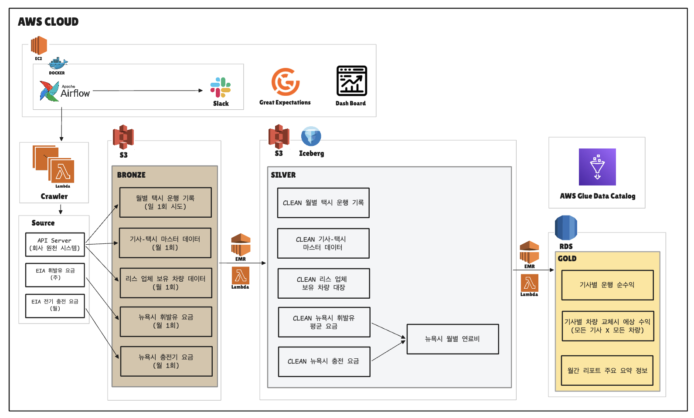
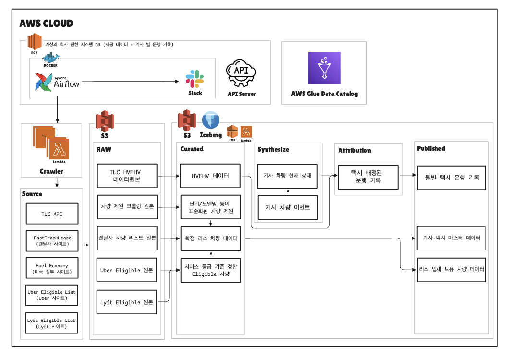

# 🚕 Theone — 주행 데이터 기반 리스 차량 추천 파이프라인

> **뉴욕 Uber·Lyft 기사 대상 차량 리스 업체를 위한 데이터 기반 차량 교체 추천 시스템**
>
> 기사의 순수익과 리스 업체의 객단가가 **동시에** 오르는 고객과 제안 차량을 매월 산출합니다.

## 목차

1. [프로젝트 개요](#1-프로젝트-개요)
2. [솔루션](#2-솔루션)
3. [기대 효과](#3-기대-효과)
4. [데이터 프로덕트](#4-데이터-프로덕트)
5. [데이터 파이프라인 설계 및 기술적 고려](#5-데이터-파이프라인-설계-및-기술적-고려)
6. [기술 스택](#6-기술-스택)
7. [팀원 소개](#7-팀원-소개)

---

## 1. 프로젝트 개요

### 배경 및 문제점

뉴욕에서 Uber·Lyft 기사에게 차량을 임대하는 리스 업체의 **고객 담당자(CSM)** 는 수백 명의 기사를 관리합니다.
이들의 매출은 기사 1인당 렌탈료, 즉 **객단가**에서 나옵니다.
그래서 더 비싼 차량으로 교체를 유도하는 것이 매출을 올리는 가장 직접적인 수단입니다.

그런데 현장에서는 그 제안이 잘 이뤄지지 않습니다.
*"더 비싼 차를 권하면 기사가 손해를 본다"* 는 통념 때문에, 객단가를 올릴 기회 자체가 검토 대상에 오르지 않습니다.

실제로는 그렇지 않은 경우가 많습니다.
연비가 좋은 차로 바꾸면 연료비가 줄고, Uber Comfort·Lyft Extra Comfort 자격이 붙는 차로 바꾸면 운임 자체가 오릅니다.
**늘어난 렌탈료보다 줄어든 연료비와 늘어난 운임이 크면 기사도 더 벌고 회사 매출도 오릅니다.**
문제는 그 판단을 할 수 없다는 데 있습니다.

### 기존 방식의 한계

기사의 순수익은 *운행 패턴 × 차량 연비 × 그달 연료 단가 × 렌트료* 가 얽힌 값이라 **감으로 계산할 수 없습니다.**
어떤 기사는 공항 장거리를 주로 뛰고 어떤 기사는 맨해튼 단거리만 뜁니다.
같은 차로 바꿔도 주행 패턴에 따라 이득이 정반대로 나옵니다.

수백 명 × 수십 종의 차량 조합을 사람이 따져 볼 수는 없습니다.
그 결과 CSM 은 **누구에게 어떤 차를 제안해야 양쪽이 모두 이득인지 판단할 근거 없이** 고객을 관리하고 있고,
회사는 객단가를 올릴 수 있었던 기회를 매달 놓치고 있습니다.

### 목표

**차량 교체 시 두 조건을 동시에 만족하는 고객을 매월 산출한다.**

```
기사 순수익 월 $600 이상 증가   AND   리스 업체 렌탈 객단가 상승
```

> 순수익·매출 계산식과 추천 기준은 [수익 계산과 추천 기준](./docs/METRICS.md) 을 참고해 주세요.

---

## 2. 솔루션

**실제 승차공유 운행 기록**에서 기사별 월 순수익을 계산하고,
모든 후보 차량으로 바꿨을 때의 손익을 시뮬레이션해 **교체를 권할 고객과 제안 차량**을 뽑습니다.

| 단계 | 설명 |
| --- | --- |
| **운행별 순수익** | 운행 기록 + 그달 연료 단가 + 현재 차량 제원 → 운행 한 건의 순수익 |
| **기사 월간 집계** | 시간대 8구간 비중, 상위 3개 운행 구역, 현재 차량, 월 순수익 |
| **교체 시뮬레이션** | 기사 × 후보 차량 전체에 대해 연비 차이·등급 상승·렌트료 차이를 반영 |
| **우선순위 산출** | `순수익 증가 ≥ $600 AND 매출 증가 ≥ 0` 을 만족하는 대상자를 증가 폭 순으로 정렬 |

### 결과물

| | 설명 |
| --- | --- |
| **차량 교체 추천 대시보드** | 이번 달 연락할 고객과 제안 차량을 순위로 제공 |
| **추천 근거 표시** | `연비` / `차량등급` / `렌트료` 중 무엇이 이득을 만들었는지 분해 |
| **월간 리포트** | 추천 대상자 수, 평균 순수익 증가액, **총 객단가 상승액** |

*(대시보드 스크린샷 삽입 예정)*

현재는 Streamlit 프로토타입([main/dashboard/app.py](./main/dashboard/app.py))으로 Gold 산출물을 검증 중이며,
화면이 확정되면 **Next.js 기반 웹 대시보드로 전환**할 예정입니다.
대시보드는 Gold 3종만 읽고 계산은 전부 파이프라인이 끝내 두므로, 프론트엔드를 바꿔도 스키마는 그대로입니다.

---

## 3. 기대 효과

| 관점 | Before | After |
| --- | --- | --- |
| **차량 추천** | 판단 기준 부재, 감에 의존 | 운행 기록 기반 순수익·객단가 **동시** 시뮬레이션 |
| **고객 우선순위** | 수백 명 중 누구부터인지 불명확 | 순수익 증가 폭 순 자동 정렬 |
| **추천 근거** | 설명 불가 | 연비·등급·렌트료 **기여도 분해** 제공 |
| **비즈니스 효과** | 업그레이드 기회 누락, 객단가 정체 | 기사 만족도 ↑ & **렌탈 객단가 ↑** |

---

## 4. 데이터 프로덕트

**공개 원천 7종**을 모아 **월 2,040만 행**의 운행 기록을 정제하고, **월 3종**의 추천 산출물을 만듭니다.
운행 기록만 실데이터이고, 공개되지 않는 회사 내부 원장은 **별도 파이프라인으로 생성**합니다.

```
공개 원천 7종  ──→  [원천 DB 파이프라인]  ──API──→  [메인 데이터 파이프라인]  ──→  산출물 3종
                       내부 원장 생성                   수집·정제·추천
                       + 기사-운행 배정
```

### 4-1. 원천과 산출물

<details>
<summary><b>공개 원천 7종</b></summary>

| 원천 | 수집 대상 | 수집 방식 | 갱신 주기 | 규모 |
| --- | --- | --- | --- | --- |
| **TLC** | HVFHV 운행 기록 | Parquet 다운로드 | 월 1회 | 월 **2,040만 행** |
| **FastTrackLease** | 렌탈 차종·주간 렌트료 | HTML 크롤링 + **이미지 OCR** | 주 1회 | 24종 |
| **FuelEconomy.gov** | 차량 제원 (연비·전비·연료종류) | CSV 다운로드 | 월 1회 | 50,242행 |
| **Uber** | Comfort 배차 자격 차량 | 내부 API | 주 1회 | 59,650행 |
| **Lyft** | Extra Comfort 자격 차량 | HTML 크롤링 | 주 1회 | 1,008행 |
| **EIA** | 뉴욕주 휘발유 주간 소매가 | XLS 다운로드 | 월 1회 | 월 1행 |
| **EIA** | 뉴욕주 전기 요금 | XLSX 다운로드 | 월 1회 | 월 1행 |

**외부 원천 수집은 전부 원천 DB 파이프라인이 맡습니다.**
메인 파이프라인은 스스로 크롤링하지 않고, 원천 DB 가 발행한 것만 소비합니다 —
수집·정제 책임과 분석·추천 책임을 섞지 않기 위해서입니다.

렌탈 카탈로그만 OCR 을 씁니다 — FastTrackLease 가 차종명과 가격을 **이미지로만** 노출하기 때문입니다.
(`pytesseract`, 모델명/제조사를 한 줄씩 잘라 인식 정확도를 확보)

</details>

<details>
<summary><b>원천 DB 가 만드는 데이터</b></summary>

| 데이터셋 | 한 행 | 규모 | 생성 방식 | 공개 |
| --- | --- | --- | --- | --- |
| `customer` | 고객 1명 | 2,000행 | 기사 성향 그룹 기반 생성 | 비공개 |
| `taxi` | 차량 1대 | 2,000행 | 카탈로그 차종 + 등급 자격 부여 | 비공개 |
| `lease_contract` | 계약 1건 | 2,000행 | 스냅샷 시점 기준 계약일 추첨 | 비공개 |
| `월별 택시 운행 기록` | 운행 1건 | 월 **2,040만 행** | TLC 실데이터에 `taxi_id` 를 시공간 제약하에 배정 | **API** |
| `기사-택시 마스터 데이터` | 기사 1명 | 2,000행 | 내부 원장에서 파생 | **API** |
| `리스 업체 보유 차량 데이터` | 차량 1대 | 2,000행 | 내부 원장에서 파생 | **API** |

TLC 원본에는 `driver_id` 도 `taxi_id` 도 없습니다.
기사 선호도·근무 한도·공차 이동시간 제약을 만족하는 **결정적(deterministic) 배정 알고리즘**으로 만들어 냅니다.

</details>

<details>
<summary><b>최종 산출물 3종</b></summary>

| 산출물 | 한 행 | 규모 | 갱신 주기 |
| --- | --- | --- | --- |
| `기사별 운행 순수익` | 기사 × 월 | 2,000행/월 | 월 1회 |
| `기사별 차량 교체시 예상 수익` | 기사 × 월 | 2,000행/월 | 월 1회 |
| `월간 리포트 주요 요약 정보` | 월 | 1행/월 | 월 1회 |

`월간 리포트` 에는 **계보 컬럼**(어느 시점 차량 대장·어느 달 연료비를 썼는지)을 함께 싣습니다.
입력이 조금만 달라도 숫자가 바뀌는데, 남기지 않으면 두 벌을 놓고 무엇이 달랐는지 되짚을 수 없습니다.

</details>

> 계층별 스키마·파티션·키 전체는 [데이터 모델 레퍼런스](./docs/DATA_MODEL.md) 를 참고해 주세요.

### 4-2. 메인 데이터 파이프라인



원천 API 3종과 EIA 연료 단가 2종을 수집해 **Bronze → Silver → Gold** 메달리온 구조로 정제합니다.

| 계층 | 역할 | 실행 런타임 |
| --- | --- | --- |
| **Bronze** | 원본 그대로 적재 (Extract → Load) | Lambda |
| **Silver** | 원천별 1:1 정제, 연료비 2종만 통합 | Lambda + Spark(EMR) |
| **Gold** | 조인·집계·시뮬레이션·추천 | Spark(EMR) → RDS |

**운행 × 리스 계약 조인을 Silver 가 아니라 Gold 에서 합니다.**
Silver 에 조인 결과를 물리 테이블로 두면 월 2,040만 행짜리 중간 산출물이 하나 더 생기는데,
그걸 읽는 곳은 Gold 하나뿐이라 저장·재계산 비용만 늘고 재사용은 없습니다.

### 4-3. 원천 DB 파이프라인



리스 업체의 사내 시스템입니다. 메달리온이 아니라 **목적별 5계층**으로 나뉩니다.

| 계층 | 내용 |
| --- | --- |
| **RAW** | 각 공개 원천의 크롤링 원본 |
| **Curated** | HVFHV 데이터 · 표준화 차량 제원 · 확정 리스 차량 · 등급 정합 Eligible 차량 |
| **Synthesize** | 기사 차량 이벤트 → 기사 차량 현재 상태 |
| **Attribution** | 택시가 배정된 운행 기록 — **`taxi_id` 가 여기서 붙습니다** |
| **Published** | 월별 택시 운행 기록 · 기사-택시 마스터 · 리스 업체 보유 차량 |

**Attribution 계층이 이 파이프라인의 존재 이유**입니다.
TLC 원본에는 `driver_id` 도 `taxi_id` 도 없어서, 시공간 제약을 만족하는 배정을 거쳐야
비로소 *"이 기사가 이 차로 벌었다"* 가 만들어집니다.

### 4-4. 두 파이프라인의 경계

경계를 넘는 통로는 **API 하나**뿐입니다. 원천이 만든 파일을 메인 파이프라인이 파일 경로로 직접 읽지 않습니다.

```
[원천 DB]                                  [메인 파이프라인]
data/source/synthetic_driver_trip_api/  ──HTTP──▶  data/bronze/
  └ year_month=YYYY-MM/                              └ 매니페스트 대조 후 적재
      ├ hvfhv_taxi_trips.parquet
      ├ driver_vehicle_leases.parquet
      ├ lease_vehicle_inventory.parquet
      └ manifest.json
```

코드도 이 경계에 맞춰 폴더로 나눠 두었습니다.

```text
sub/       외부·가상 원천 수집, 합성, 정제, Published API 발행     DAG 8개
main/      Published 원천 소비, 운행 분석, Gold, 대시보드          DAG 9개
shared/    두 제품이 함께 쓰는 최소 Airflow/Spark/Lambda 기술 계약
schema/    제품 간 데이터 계약
libs/      런타임 중립 공통 라이브러리
```

**`main` 은 `sub` 의 내부 파일을 직접 참조하지 않고 Published API 를 원천으로 소비합니다.**
같은 디스크에 있어도 API 를 거치게 해야 수집·검증·백필이 실제로 동작하는 코드가 됩니다.

<details>
<summary><b>아키텍처와 현재 구현의 차이</b></summary>

아키텍처는 목표 형상이고, 코드가 아직 따라가지 못한 지점이 넷 있습니다.

| 항목 | 아키텍처 | 현재 코드 |
| --- | --- | --- |
| API 제공 데이터셋 | 3종 | **3종** — 운행·리스·보유 차량 모두 메인 파이프라인이 수집 |
| 운행 기록 수집 | 일 1회 시도 | **월 1회** (10일 00:00) |
| 운행 × 리스 조인 위치 | **Gold** | **Silver** — `hvfhv_driver_trip` 중간 테이블이 남아 있음 |
| 저장 포맷·서빙 | Iceberg · RDS · Glue Catalog | Parquet 직접 적재 · Gold 는 CSV 파일 |

</details>

---

## 5. 데이터 파이프라인 설계 및 기술적 고려

### 5-1. 기술적 고려사항

- [Spark 최적화 — Arrow 직접 메모리 초과와 그룹 키 재설계](./docs/SPARK_OPTIMIZATION.md)
- [데이터 모델링 — 계층별 스키마와 스키마 소유권 중앙화](./docs/DATA_MODEL.md)

### 5-2. 비즈니스 로직 고려 사항

- [순수익·객단가 계산식과 추천 기준선](./docs/METRICS.md)
- [TLC 에 없는 서비스 등급을 데이터에서 추정하기](./docs/METRICS.md#3-요금-배수는-어디서-오는가)
- [Gold 레이어 설계](./docs/GOLD_LAYER_DESIGN.md)

### 5-3. 운영 고려 사항

- [원천 DB 파이프라인을 따로 만든 이유 — 백필 테스트가 불가능했다](./docs/SOURCE_PIPELINE.md)
- [원천을 신뢰하지 않는 전제로 수집하기 — 매니페스트 데이터 계약](./docs/SOURCE_CONTRACT.md)
- [데이터 품질 — 검증 게이트 · 원자적 공개 · 스키마 드리프트](./docs/DATA_QUALITY.md)
- [Airflow 운영 — 태스크 설계와 장애 알림](./docs/AIRFLOW_OPS.md)
- [로컬 개발 환경 구성](./docs/GETTING_STARTED.md)
- [팀 협업 규칙 — Branch · Commit · PR · 리뷰 훅](./docs/TEAM_RULES.md)

### 5-4. 의사결정 기록

날짜별 의사결정 20건을 [docs/decision_making](./docs/decision_making/) 에 남겼습니다.
결론뿐 아니라 **기각한 대안과 그 이유**를 함께 적었습니다.

---

## 6. 기술 스택

<div align="center">

### Data Processing


### Storage


### Compute / Infrastructure


### Orchestration / Quality


### Visualization

-000000?style=for-the-badge&logo=nextdotjs&logoColor=white)

</div>

<details>
<summary><b>주요 기술 선택의 근거</b></summary>

| 영역 | 선택 | 대안 | 근거 |
| --- | --- | --- | --- |
| 오케스트레이션 | **Airflow on EC2 (Docker)** | ECS Fargate, MWAA | 태스크가 대부분 월·주 단위 배치라 상시 기동 비용이 낮음 |
| 수집 런타임 | **Lambda** | EC2 상주 프로세스 | 수집은 짧고 드문 작업. 상시 프로세스로 두면 유휴 비용만 남음 |
| 대용량 처리 | **Spark (EMR)** | Pandas, DuckDB | 월 2,000만 행 × 후보 조인. 단일 노드 메모리로 감당 불가 |
| 데이터 검증 | **Great Expectations** | 직접 assert | 규칙을 데이터로 선언하고 실패 리포트를 자동 발행 |
| 의존성 관리 | **uv (런타임별 lock 3개)** | 단일 venv, Poetry | Lambda/Spark/Airflow 의 pandas·numpy 요구가 충돌 |
| 파티셔닝 | **Hive-style (`key=value`)** | 디렉터리 나열 | 파티션 프루닝이 그대로 동작. `partitionOverwriteMode=dynamic` 으로 재실행 시 해당 파티션만 덮어씀 |
| 대시보드 (현재) | **Streamlit 프로토타입** | 처음부터 웹 프레임워크 | 화면 확정 전에 프론트엔드를 세우면 버릴 코드가 됨 |

**계획 중 (미구현)**

| 영역 | 계획 | 현재 상태 |
| --- | --- | --- |
| 테이블 포맷 | Iceberg (HVFHV 대상) | 도입 결정 완료, 아직 Parquet 직접 적재 |
| Gold 서빙 | RDS | 현재 CSV 파일로 산출 |
| 대시보드 | Next.js | 프레임워크 미확정, 현재 Streamlit |

</details>

---

## 7. 팀원 소개

<table align="center">
  <tr>
    <td align="center"><a href="https://github.com/kingrangE"><b>전길원</b></a></td>
    <td align="center"><a href="https://github.com/taeju-moon"><b>문태주</b></a></td>
    <td align="center"><a href="https://github.com/HongJunseong"><b>홍준성</b></a></td>
    <td align="center"><a href="https://github.com/inerasable0203"><b>최지욱</b></a></td>
  </tr>
  <tr>
    <td align="center"><a href="https://github.com/kingrangE"></a></td>
    <td align="center"><a href="https://github.com/taeju-moon"></a></td>
    <td align="center"><a href="https://github.com/HongJunseong"></a></td>
    <td align="center"><a href="https://github.com/inerasable0203"></a></td>
  </tr>
  <tr>
    <td align="center"><b>DE</b></td>
    <td align="center"><b>DE</b></td>
    <td align="center"><b>DE</b></td>
    <td align="center"><b>DE</b></td>
  </tr>
</table>
