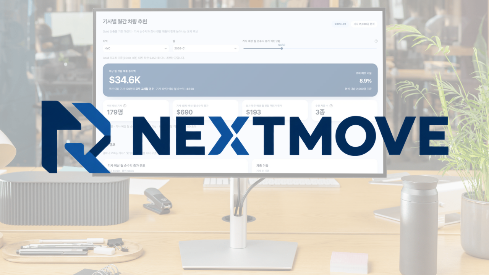
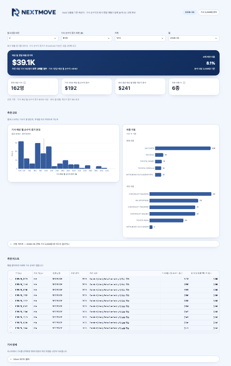
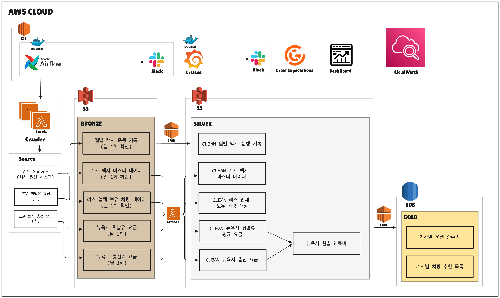
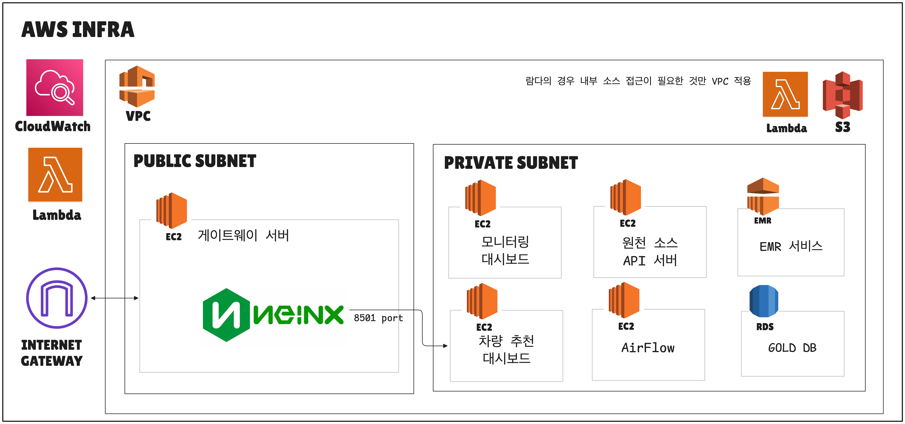
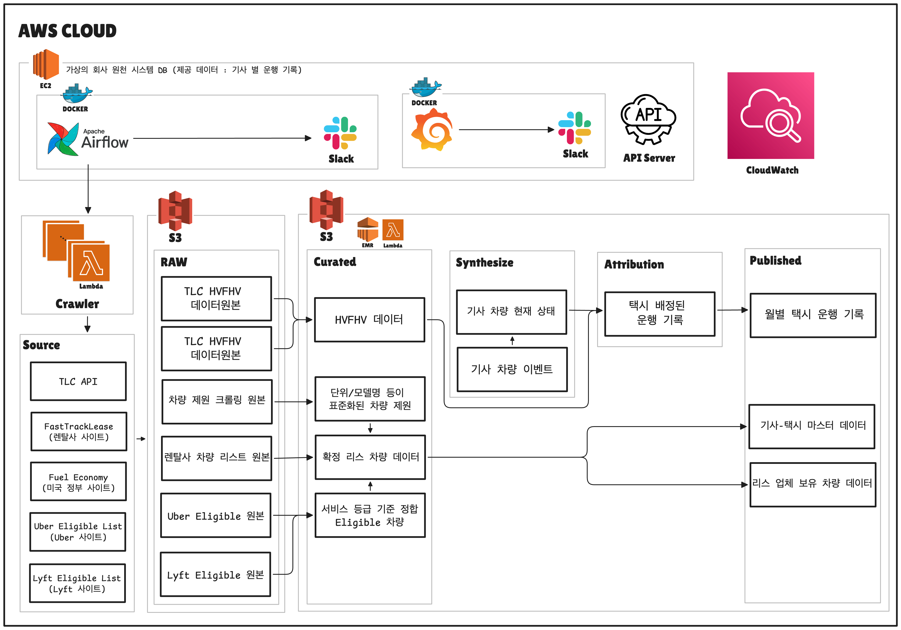

<h4><b>택시 차량 리스 업체를 위한 운행 데이터 기반 차량 교체 추천 대시보드</b></h4>

NEXTMOVE는 운행 데이터를 기반으로 차량 교체를 제안할 고객을 확인할 수 있는 대시보드입니다. 
이때, 추천 대상은 상위 등급 차량 교체시 고객의 순수익이 월 $500 이상 증가하는 고객입니다.

 

## 목차

1. [프로젝트 개요](#프로젝트-개요)
2. [데이터 파이프라인](#데이터-파이프라인)
3. [문서화](#문서화)
4. [기술 스택](#기술-스택)
5. [팀원](#팀원)

## 프로젝트 개요 
### 대상 
- 뉴욕 Uber·Lyft 기사 대상 차량 리스 업체의 고객 담당자
### 문제점
- 객단가 향상을 통한 매출 상승 기회 상실 
  - 기사에게 더 높은 순수익을 주면서도 리스 업체의 객단가를 끌어올릴 수 있는 차량을 데이터 기반으로 추천하지 못함
### 해결방안
- 차량 교체 권장 고객 및 제안 차량 추천 대시보드
  - 대시보드 조건 : 차량 변경 시 '기사 순수익 월 500$ 이상 증가 & 리스 업체 렌탈 객단가 상승'

### 기대 효과

| 관점 | AS-IS | TO-BE |
| --- | --- | --- |
| **차량 추천** | 판단 기준 부재, 감에 의존 | 운행 기록 기반 순수익을 고려한 데이터 기반 추천 |
| **고객 우선순위** | 수천명 중 누구에게 전화할지 불명확 | 순수익 증가폭 순 정렬 |
| **비즈니스 효과** | 수익 증가 기회 놓침 | 기사 만족도 향상, 객단가 증가 |

### 결과 이미지

대시보드 이미지 확인

 

[목차로 이동](#목차)

 

## 데이터 파이프라인

### 1. INPUT

| 출처 | 수집 대상 | 수집 방식 | 수집 주기 | 규모 |
| --- | --- | --- | --- | --- |
| 회사 가상 원천 DB | 월별 택시 운행 기록 | API 요청 | 일 1회 | 월 **70-90만 행** |
| 회사 가상 원천 DB | 렌탈 차종, 등급, 제원, 주간 렌트료 등 | API 요청 | 일 1회 | 12종 |
| 회사 가상 원천 DB | 월별 기사-택시 테이블 | API 요청 | 일 1회 | 약 2000 행 |
| **EIA** | 뉴욕주 휘발유 주간 소매가 | XLS 다운로드 | 월 1회 | 월 1행 |
| **EIA** | 뉴욕주 전기 요금 | XLSX 다운로드 | 월 1회 | 월 1행 |

### 2. OUTPUT

| 데이터 | 주요 정보 | 계산 방식 |
|---|---|---|
| 기사 현재 예상 순수익 | 기사의 현재 운행 예상 수익 | 수익 - 주간 유류비 + 주간 렌트료 |
| 기사별 차량 교체시 예상 수익 | 기사-차량 조합별 예상 수익 | 현재 운행 예상 수익 산식을 각 차량에 적용 |

### 3. 파이프라인

> 가상 사내 시스템과 EIA에서 데이터를 수집해 **메달리온 정제 구조** 설계

| 계층 | 역할 | 실행 런타임 | 적재 위치|
| --- | --- | --- | --- |
| **Bronze** | 원본 적재, 수집 품질 검증 | Lambda | S3 |
| **Silver** | 원본별 정제, 연료비 통합, 레코드 품질 검증 | Lambda or Spark(EMR) | S3|
| **Gold** | 비즈니스 로직 적용, 조인, 집계, 시뮬레이션, 추천 | Lambda or Spark(EMR) | RDS |

### 4. AWS Infra Architecture

- [AWS 서비스별 역할 및 설명](/docs/AWS_INFRA.md)
- 주요 항목
  - **Lambda** : 역할에 따른 VPC 위치 구분
    1. VPC 내부 : 원천 소스 API 서버와 상호작용하는 것
        - 가정 : 리스 **회사 내의 개발자**가 개발한 **데이터 파이프라인**
    2. VPC 외부 : 그 외 외부 통신 IAM 최소 권한으로 보안 확보
  - **NGINX** : 리버스 프록시를 이용한 대시보드 접근 경로 단일화 / 내부 포트 은닉
    - Public의 Nginx가 요청을 받아 Private 차량 추천 대시보드로 리버스 프록시
    - 외부 사용자는 NginX를 통해서만 접근
  - **모니터링 대시보드** : 외부망 노출 X (내부 전용)

 

원천 DB 파이프라인

> HVFHV 데이터에 택시 ID/기사 ID가 없기에 합성을 진행하는 **가상의 회사 DB**입니다.

#### 1. INPUT
| 출처 | 수집 대상 | 수집 방식 | 수집 주기 | 규모 |
| --- | --- | --- | --- | --- |
| TLC | HVFHV(Uber/Lyft 운행 기록) | parquet 다운로드 | 일 1회 | 월 **2000만행** |
| FastTrackLease(렌탈사 사이트) | 렌탈 차종 및 주간 렌트료 | 웹 크롤링 | 월 1회 | 차량 12종 |
| Fuel Economy(미국 정부 사이트) | 차량 제원(연비 등) | API 요청 | 월 1회 | 약 50000행 |
| Uber Eligible List(Uber 사이트) | Uber 차량별 서비스 등급 | 웹 크롤링 | 월 1회 | 월 1행 |
| Lyft Eligible List(Lyft 사이트) | Lyft 차량별 서비스 등급 | 웹 크롤링 | 월 1회 | 월 1행 |

#### 2. OUTPUT
| 데이터 | 한 행 | 규모 | 생성 방식 | 공개 |
| --- | --- | --- | --- | --- |
| `월별 택시 운행 기록` | 운행 1건 | 월 **2,040만 행** | TLC 실데이터에 `taxi_id` 를 시공간 제약하에 배정 | **API** |
| `기사-택시 마스터 데이터` | 기사 1명 | 2,000행 | 내부 원장에서 파생 | **API** |
| `리스 업체 보유 차량 데이터` | 차량 1대 | 2,000행 | 내부 원장에서 파생 | **API** |

#### 3. 배정 알고리즘 (데이터 합성)
- 목표 : 현실적인 기사 데이터 배정
- 방식 : **결정적(deterministic) 배정 알고리즘**
  - 기사 선호도 / 근무 한도 / 공차 이동시간 제약을 만족하는 알고리즘

#### 4. 파이프라인

> 원천 DB에서 생성한 데이터를 **API로 메인 데이터 파이프라인에서 수집**합니다.

| 계층 | 내용 |
| --- | --- |
| **RAW** | 실제 원천 데이터의 원본 저장 |
| **Curated** | 표준화, 정제된 데이터 저장 |
| **Synthesize** | 데이터 합성 과정 저장 |
| **Attribution** | 합성된 데이터와 실제 데이터를 매핑|
| **Published** | 해당 원천 시스템에서 제공하는 데이터 |

 

[목차로 이동](#목차)

## 문서화

### 성능 최적화
> Spark 성능 최적화

### 데이터 프로덕트의 완성도
> 핵심 기능 구현, E2E 동작 완성도, 결과물 형태 관련 문서

<a href="/docs/data_product_completeness/README.md">데이터 프로덕트 완성도</a>

- 사용자 문제와 핵심 기능, 원천→Bronze→Silver→Gold→대시보드 E2E 흐름과 실행·검증 절차, 구현 완료·제약·후속 과제를 실제 산출물 예시와 함께 정리했습니다.

### 파이프라인 설계 및 코드 품질
> 파이프라인 설계 및 데이터 품질 관리

<a href="/docs/pipeline_design_and_data_quality/PIPELINE_LAYERS_AND_CONTRACTS.md">파이프라인 계층·DAG 의존성·버전 계약</a>

- 계층 : Bronze(원본, S3, Lambda) → Silver(정제, S3, Lambda 또는 Spark) → Gold(집계·추천, RDS, Spark)
- DAG 의존성 : Airflow Asset으로 체이닝. 커스텀 센서·브랜치 없이 파티션 키(`{service_area}:{year_month}`) 단위로 자동 트리거
- 버전 계약 : Bronze `collected_at`, Silver `source_collected_at`, Gold `version`+`load_fingerprint`. 같은 입력이면 fingerprint가 같아 재실행해도 버전이 늘지 않음

<a href="/docs/pipeline_design_and_data_quality/GOLD_RECOMMENDATION_LOGIC.md">Gold 추천 로직 (v1/v2)</a>

- v1(ProfitFirst) : 기사 순수익 기준 배정, 회사 매출에 기여 못 하는 교체만 제외
- v2(RevenueFirst, threshold별) : 회사 매출 기준 배정, 순수익증가가 threshold 미만인 교체만 제외

<a href="/docs/pipeline_design_and_data_quality/DATA_QUALITY_AND_LINEAGE.md">스키마 검증·품질 게이트·계보 추적</a>

- 스키마 : 계층별 `pyarrow.Schema`(`schema/`)를 기준으로 컬럼 누락·타입 불일치를 진단
- 품질 게이트 : Bronze·Silver는 Great Expectations로 행 수·필수값·스키마를 검사하고, 통과 여부를 `_SUCCESS`/`_QUARANTINED.json`으로 남김
- Gold : GX 대신 Spark에서 직접 짠 비즈니스 불변식 검사를 통과해야 적재가 시작되고, 계보(`silver_lineage`)는 검사와 별개로 항상 기록

<a href="/docs/pipeline_design_and_data_quality/CODE_AND_CONFIG_STRUCTURE.md">코드 구조와 설정값 분리</a>

- 코드 구조 : Lambda·Spark·Airflow 3개 런타임이 공유하는 순수 인터페이스(`libs/pipeline_core`)와, 런타임별 SDK를 쓰는 헬퍼(`shared/{aws_lambda,spark,airflow}/common`)를 분리
- 설정값 : 재배포 없이 바꿔야 하는 값(threshold, freshness SLA 등)은 Airflow Variable로, 환경마다 달라지는 값(버킷, DSN, 리전)은 환경변수로, 코드 로직에 붙는 상수는 그 로직 옆에 둠

### 운영 용이성 및 안정성
> 파이프라인 운영 안정성과 관련된 문서

<a href="/docs/pipeline_operations_and_reliability/SELECTIVE_API_REFRESH_AND_SINGLE_GOLD_RUN.md">변경된 API 데이터만 처리하고 최종 계산은 한 번만 실행</a>

- 변경된 API만 처리하고, 같은 지역·월의 Silver 입력이 모두 준비됐을 때 최종 계산을 한 번만 시작합니다.

<a href="/docs/pipeline_operations_and_reliability/PIPELINE_IDEMPOTENCY_AND_LINEAGE.md">같은 입력을 다시 실행해도 결과가 늘어나지 않는 버전 관리</a>

- 실제 입력 내용과 계산 설정이 같으면 기존 결과를 재사용하고, 변경됐을 때만 새 버전을 만듭니다.

<a href="/docs/pipeline_operations_and_reliability/CORRECTNESS_BEFORE_SUCCESS.md">DAG 성공이 아닌 데이터 정합성으로 완료를 판단</a>

- 입력 선택, 변환 전후 행 수, 집계 합계, 실제 적재 행을 확인한 뒤에만 결과를 공개합니다.

<a href="/docs/pipeline_operations_and_reliability/OBSERVABILITY_FROM_RUN_TO_DATA.md">작업 실패와 데이터 갱신 지연을 함께 감지</a>

- 실패한 작업뿐 아니라 작업이 시작되지 않아 최종 데이터가 오래 갱신되지 않는 경우도 확인합니다.

<a href="/docs/pipeline_operations_and_reliability/DATA_LIFECYCLE_WITHOUT_DATA_LOSS.md">최신 정상본은 보호하고 오래된 버전만 정리</a>

- 지역·월별 최신 정상본은 기간과 관계없이 남기고, 90일이 지난 S3와 데이터베이스 구버전만 정리합니다.

### 서버·인프라
> AWS 서버·네트워크 설계와 운영 중 해결한 문제

<a href="/docs/AWS_INFRA.md">AWS 인프라 구성</a>

- Airflow·대시보드·모니터링 서버를 역할별 EC2와 private subnet으로 분리했습니다.
  - Nginx를 단일 진입점으로 두고 IAM Role과 보안 그룹으로 서비스별 권한·통신 범위를 제한합니다.

<a href="/docs/MONITORING.md">모니터링 구축</a>

- 감시 대상이 두 종류라 도구를 나눴습니다 — EC2 호스트 4대는 Prometheus + Grafana, EMR Serverless 는 CloudWatch.
  - 임계값은 실측 평시값을 기반으로 설정하고, 대시보드에서 겪은 문제 4개(지표 한도 초과·값 5배 부풀림 등)를 실측 기반으로 고쳤습니다.

<a href="/docs/troubleshooting/aws/CFN_INSTANCE_ID_PARAM_TYPE.md">CloudFormation 배포가 exit 255 로만 죽음</a>

- 인스턴스 ID 파라미터 타입이 `AWS::EC2::Instance::Id`라 배포 role에 없는 `ec2:DescribeInstances` 호출이 거부됐습니다.
  - 결과: `Type: String` + `AllowedPattern`으로 교체해 해결했습니다.

### 기타
> 위 분류에 속하지 않는 트러블슈팅

<a href="/docs/troubleshooting/etc/DASHBOARD_QUERY_SLOW.md">대시보드 조회가 서브쿼리 인덱스 미스로 30초까지 느려짐</a>

- PK가 `(service_area, year_month, version, ...)`로 바뀌며 상관 서브쿼리 조건(`year_month`만)이 선두 컬럼과 어긋나 인덱스를 못 타고 O(n²)에 가깝게 느려졌습니다.
  - 결과: 서브쿼리 조건에 `service_area`를 추가해 PK 선두 컬럼과 일치시켜 인덱스를 다시 타도록 했습니다.

### [의사결정 문서](./docs/decision_making/README.md)
> 팀내 의견 공유를 통해 날짜별 의사결정한 내용(기술/기획 등) 정리

 

[목차로 이동](#목차)
 

## 기술 스택

### Data Processing

### Storage

### Compute / Infrastructure

### Orchestration / Quality

### Monitoring

### Visualization

### ETC

### AI 기술

 

[목차로 이동](#목차)
 
 

## 팀원

<table align="center">
  <tr>
    <td align="center"><a href="https://github.com/kingrangE"><b>전길원</b></a></td>
    <td align="center"><a href="https://github.com/taeju-moon"><b>문태주</b></a></td>
    <td align="center"><a href="https://github.com/HongJunseong"><b>홍준성</b></a></td>
    <td align="center"><a href="https://github.com/inerasable0203"><b>최지욱</b></a></td>
  </tr>
  <tr>
    <td align="center"></td>
    <td align="center"></td>
    <td align="center"></td>
    <td align="center"></td>
  </tr>
  <tr>
    <td align="center"><b>DE</b></td>
    <td align="center"><b>DE</b></td>
    <td align="center"><b>DE</b></td>
    <td align="center"><b>DE</b></td>
  </tr>
</table>
 

[목차로 이동](#목차)
