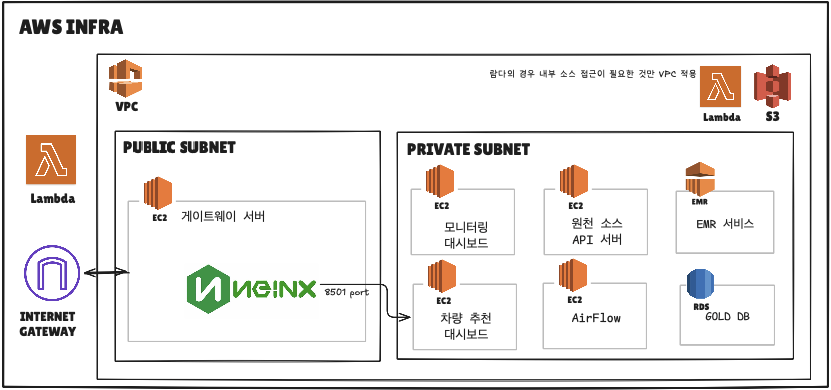

# AWS 인프라 구성

각 서비스가 어떤 역할을 맡고, 왜 그 위치(VPC 안/밖, public/private subnet)에 있는지 정리.

## 노드별 설명

### 1. 게이트웨이 서버
- SSH로 private subnet 내 다른 서버에 접속하기 위한 게이트웨이
- 웹에서 차량 추천 대시보드에 접근하기 위한 프록시 서버로도 사용

### 2. 모니터링 대시보드
- 다른 AWS 인프라의 CPU 점유율 등을 모니터링하는 그라파나 서버
- 외부망에 노출시키지 않음

### 3. 차량 추천 대시보드
- 실제 웹사이트로 보여지는 화면
- 내부망에서 게이트웨이 서버를 거쳐 외부 웹사이트로 배포

### 4. 원천 API 서버
- 실제 리스 업체의 API 서버라고 가정
- 서브 파이프라인의 결과물이 이 서버에 오게 됨

### 5. Airflow 서버
- Airflow가 띄워지는 서버

### 6. EMR
- Silver/Gold 계층의 대용량 Spark 처리 실행

### 7. RDS
- 집계된 Gold 데이터가 이곳에 모이게 됨

### 8. S3
- Bronze, Silver 데이터가 이곳에 적재됨
- 서브 파이프라인의 데이터도 이곳에 적재됨

### 9. Lambda
- 원천 소스 API 서버와 상호작용하는 람다만 VPC 내부에 위치
- 그렇지 않은 다른 람다는 VPC 적용 X. IAM 실행 권한을 철저하게 하여 보안성 확보
