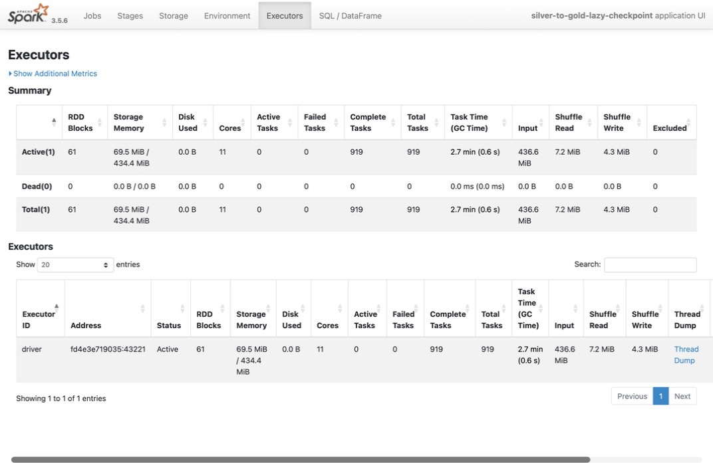
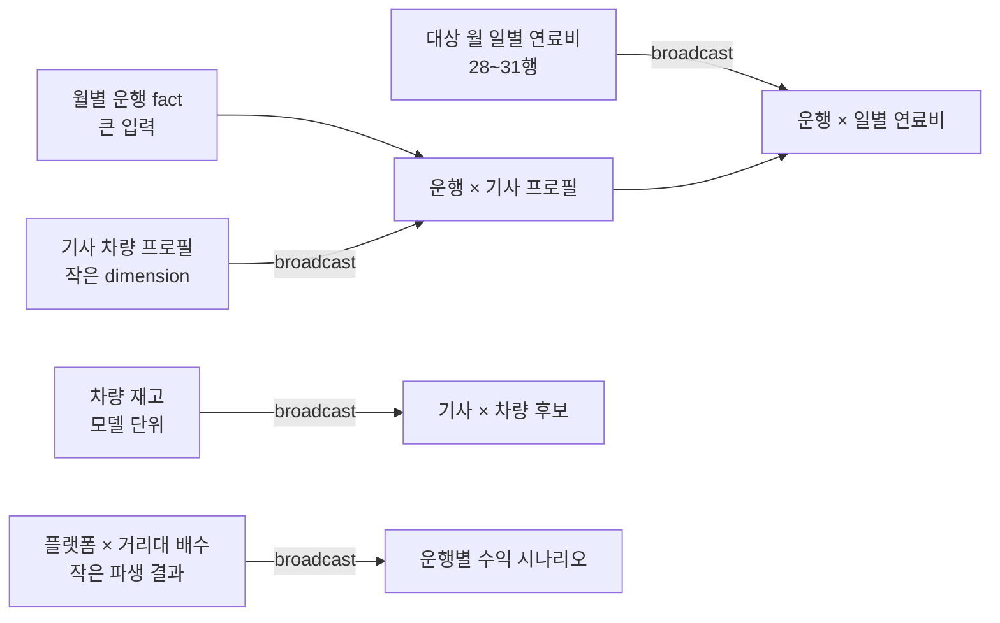

# Silver → Gold Broadcast Join 최적화

## 1. 문서 목적

Silver → Gold job은 월별 운행 fact와 기사 차량 스냅샷, 차량 재고, 일별 연료비를
결합하고, 기사별 차량 후보를 계산한다. 입력들의 크기와 역할은 대칭적이지 않다.

- 월별 운행: join의 큰 쪽. 운행 한 건당 한 행이다.
- 기사 차량 프로필: 기사·택시 단위의 작은 dimension이다.
- 차량 재고: 차량 모델 단위의 작은 dimension이다.
- 일별 연료비: 대상 월 기준 28~31행이다.
- 운행 등급 배수: 플랫폼 2종 × 거리 구간 5종에서 파생되는 작은 결과다.

큰 운행 데이터를 작은 dimension과 일반 shuffle join하면 양쪽 데이터를 join key로
재분배하고 정렬하는 비용이 생길 수 있다. 작은 쪽을 executor마다 복제하는 broadcast
join이 이 데이터 형태에 적합한지 Spark UI와 통제 실험으로 확인했다.

- 공식 설명: [Spark SQL Performance Tuning — Join Strategy Hints](https://spark.apache.org/docs/3.5.6/sql-performance-tuning.html#join-strategy-hints-for-sql-queries)
- Spark UI 지표 설명: [Spark 3.5.6 Web UI — SQL metrics](https://spark.apache.org/docs/3.5.6/web-ui.html#sql-metrics)
- 적용 코드: [`transformer.py`](../main/spark/jobs/silver_to_gold/transformer.py)

## 2. Spark UI에서 읽은 단서

채택 구성의 Spark UI `Executors` 화면에서 누적 Input은 `436.6 MiB`, Shuffle Read는
`7.2 MiB`, Shuffle Write는 `4.3 MiB`였다. 전체 pipeline에는 groupBy와 Window shuffle도
포함되므로 이 값 전부를 join의 효과로 돌릴 수는 없다. 다만 수백 MiB의 입력 전체가
dimension join마다 양쪽 shuffle된 형태는 아니었고, 큰 운행 쪽을 그대로 둔 채 작은 쪽을
전달하는 실행전략을 검토할 근거가 됐다.



이 화면만으로 특정 join operator가 `BroadcastHashJoin`이었다고 단정하지 않는다.
Spark UI `SQL / DataFrame` 상세 화면에서는 다음을 함께 확인해야 한다.

1. equi-join에 `BroadcastHashJoin`이 선택됐는지
2. cross join에 `BroadcastNestedLoopJoin`이 선택됐는지
3. 작은 쪽에 `BroadcastExchange`가 위치하는지
4. `BroadcastExchange`의 `data size`와 `time to collect`
5. 같은 query에 불필요한 `Exchange hashpartitioning`이 추가되지 않았는지

현재 저장된 UI 이미지는 Executor 누적 화면이며 SQL operator 상세 캡처는 남아 있지 않다.
따라서 최종 판단은 아래 코드의 명시적 hint와 broadcast를 완전히 끈 통제 실험을 함께
근거로 사용한다.

## 3. 적용 판단

Spark의 `broadcast()`는 작은 DataFrame을 build side로 쓰도록 optimizer에 join hint를
제공한다. 공식 문서상 `BROADCAST` hint는 통계상 크기가
`spark.sql.autoBroadcastJoinThreshold`를 넘더라도 broadcast join을 우선하도록 한다.
단, join 유형이 해당 전략을 지원하지 않으면 hint가 항상 보장되는 것은 아니므로 실제
physical plan 확인이 필요하다.

이 job에서는 테이블 크기를 알고 있는 코드가 명시적으로 작은 쪽을 지정한다. 파일 통계나
환경별 자동 추정에만 의존하지 않아 로컬 Parquet와 S3 입력에서 같은 의도를 유지한다.



## 4. 적용 지점과 이유

### 4.1 기사 차량 스냅샷 → 보유 차량

```python
profile_join = snapshots.join(
    F.broadcast(vehicles),
    profile_condition,
    "inner",
)
```

차량 재고는 모델 단위 dimension이고 기사 스냅샷보다 작다. 차량 쪽을 broadcast해 모델과
차량 속성 일치 여부를 확인한다.

### 4.2 운행 → 기사 차량 프로필

```python
trip_rows.join(
    F.broadcast(profile_rows),
    trip_profile_condition,
    "inner",
)
```

운행은 월별 fact이고 profile은 기사·택시 단위다. profile을 executor에 복제해 큰 운행
DataFrame을 `taxi_id` 기준으로 재분배하지 않도록 의도를 명시한다.

### 4.3 운행 → 일별 연료비

```python
.join(
    F.broadcast(price_rows),
    trip_price_condition,
    "inner",
)
```

대상 월 연료비는 날짜별 28~31행이다. broadcast 비용이 제한적이고, 운행을 날짜 기준으로
다시 shuffle하는 비용을 피하기 적합하다.

### 4.4 운행 → 거리 구간별 등급 배수

```python
rows = banded.join(
    F.broadcast(multipliers),
    ["hvfhs_license_num", "_distance_band"],
    "left",
)
```

배수는 운행에서 계산되지만 최종 키 공간은 플랫폼과 고정 거리 구간 조합으로 작다.
작아진 결과를 다시 대량 운행에 붙이는 단계이므로 broadcast 대상이다.

### 4.5 기사 집계 → 차량 후보 cross join

```python
candidates = driver_metrics.crossJoin(F.broadcast(available))
```

기사마다 보유 차량 후보를 평가해야 하므로 논리적으로 cartesian product가 필요하다.
차량 후보가 작은 dimension이라는 조건을 명시해 큰 양쪽을 교차시키는 계획을 피한다.
equi-key가 없는 cross join이므로 physical plan에서는 일반적으로
`BroadcastNestedLoopJoin` 후보가 된다.

### 4.6 참조 정합성 검증

```python
unmatched = left.join(F.broadcast(right), condition, "left_anti")
```

본 join 전에 미매칭 key를 찾는 left-anti join도 같은 dimension을 사용한다. 성능 때문에
정합성 검증을 제거하지 않고 작은 참조 데이터를 broadcast해 검증 비용을 제한한다.

## 5. 통제 실험

명시적 `broadcast()`만 제거하면 Spark가 자동 broadcast를 다시 선택할 수 있다. 따라서
다음 두 조건을 함께 적용해 broadcast join을 완전히 비활성화했다.

1. 코드의 명시적 `F.broadcast()` hint 제거
2. `spark.sql.autoBroadcastJoinThreshold=-1` 설정

그 외 입력, 변환 로직, `spark.sql.shuffle.partitions=32`, AQE 상태는 동일하게 유지했다.
측정 범위는 Silver 읽기부터 Gold 3종 `toPandas()` 완료까지이며 Gold 적재는 제외했다.

| 구성 | 실행시간 | Gold 행 수 (`집계 / 추천 / 보고서`) | 기준 대비 |
| --- | ---: | ---: | ---: |
| **broadcast 유지** | **25.194초** | **2,000 / 2,000 / 1** | 기준 |
| broadcast 완전 비활성화 | 28.777초 | 2,000 / 2,000 / 1 | **3.583초, 14.2% 느림** |

broadcast를 끄면 실행시간이 14.2% 증가했고 결과 행 수는 같았다. 기능 차이가 아니라 join
실행전략의 차이로 성능이 변한 것이므로 기존 broadcast를 유지했다.

이 수치는 단일 실행의 절대 성능을 일반화한 값이 아니다. 현재 데이터와 자원에서
broadcast를 제거했을 때의 상대 차이다. 반복 실행 중앙값과 SQL operator별 runtime metric은
향후 성능 기준선을 갱신할 때 보강할 수 있다.

## 6. 메모리와 실패 조건

Broadcast Join은 shuffle을 줄이는 대신 작은 DataFrame을 executor마다 보관한다. 다음 조건이
바뀌면 무조건 유지해서는 안 된다.

- 서비스 지역과 차량 모델이 늘어 dimension이 executor memory에 비해 커지는 경우
- broadcast 준비 시간이 전체 실행시간에서 유의미하게 커지는 경우
- Spark UI에서 executor memory pressure 또는 GC 증가가 확인되는 경우
- `spark.sql.broadcastTimeout` 초과가 발생하는 경우

현재 broadcast 대상은 모델 단위 재고, 월 28~31행의 연료비, 기사 프로필, 고정 거리대 배수다.
월별 운행 fact 자체는 broadcast하지 않는다. 대상 크기 방향을 반대로 지정하면 executor별
메모리 사용량과 네트워크 전송량이 급격히 증가할 수 있다.

## 7. 재검증 절차

데이터 규모나 join 로직이 바뀌면 다음 순서로 확인한다.

1. 같은 월 입력으로 baseline을 실행한다.
2. Spark UI `SQL / DataFrame`에서 `BroadcastExchange`, `BroadcastHashJoin`,
   `BroadcastNestedLoopJoin`과 build side를 확인한다.
3. broadcast data size와 collect time을 기록한다.
4. hint 제거와 `autoBroadcastJoinThreshold=-1`을 함께 적용한 대조군을 실행한다.
5. 실행시간뿐 아니라 shuffle read/write, spill, peak execution memory를 비교한다.
6. Gold 3종 행 수와 정렬 후 hash가 같은지 확인한다.

## 8. 결론

이 job의 broadcast는 단순히 Spark 기본값에 기대는 자동 최적화가 아니다. 데이터의 역할과
카디널리티를 알고 있는 코드가 작은 dimension을 명시하고, broadcast를 완전히 끈 대조군이
14.2% 느려진 것을 확인한 뒤 유지한 결정이다. 현재 입력 규모에서는 작은 쪽 복제 비용보다
큰 운행 DataFrame의 반복 shuffle을 피하는 이득이 컸다.
