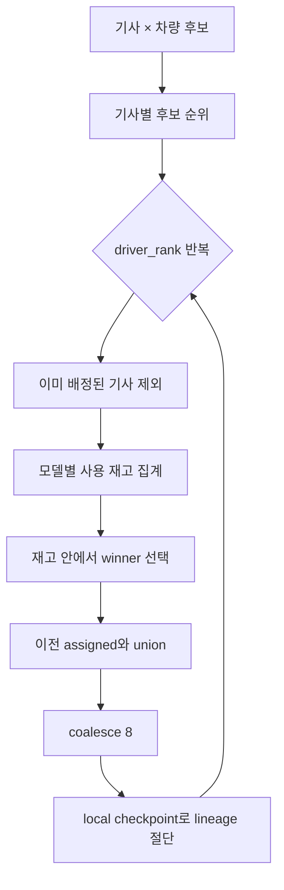
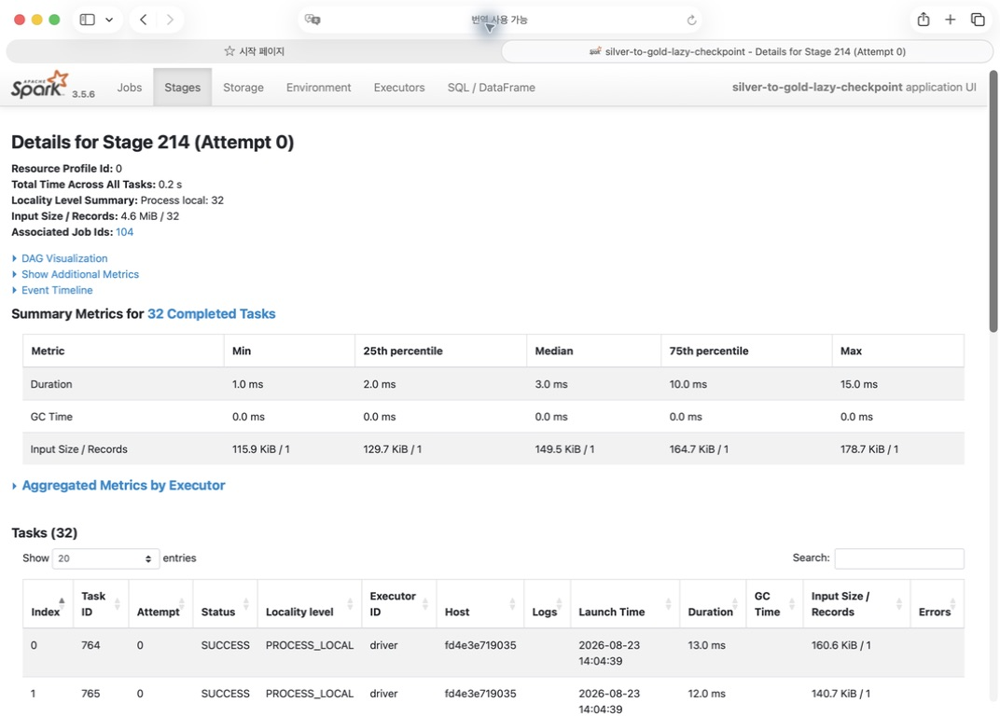
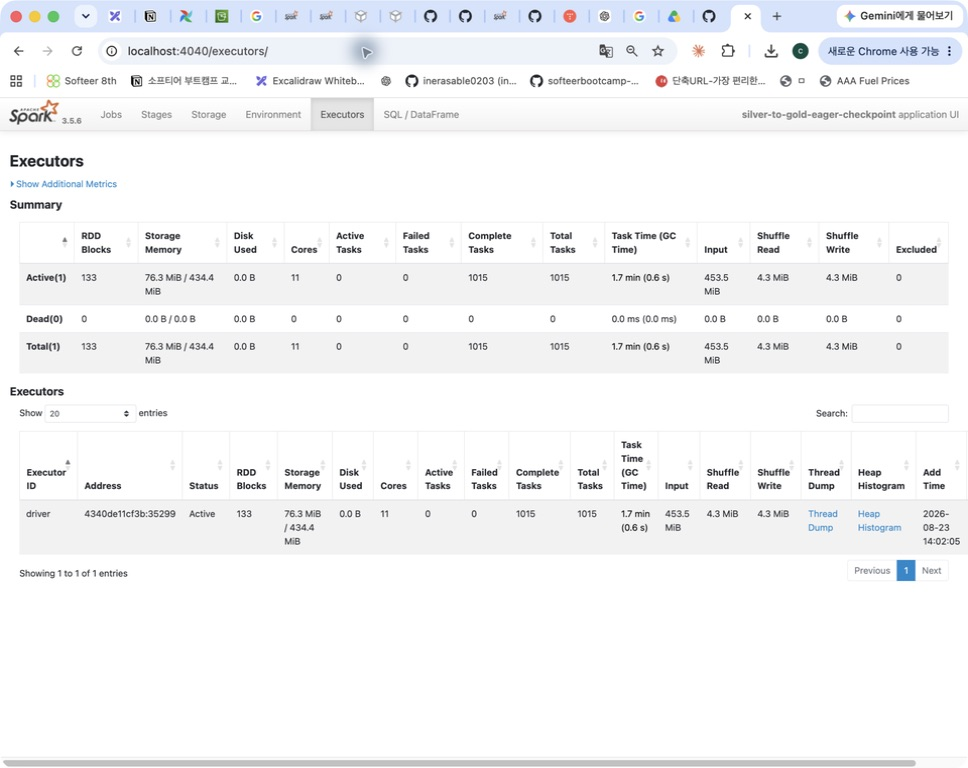

# Silver → Gold Lazy Local Checkpoint 최적화

## 1. 문서 목적

Silver → Gold 차량 추천은 기사별 후보 순위를 계산한 뒤 차량 재고 안에서 순위별로 배정한다.
이 과정은 `_allocate_candidates_by_stock()`의 반복문에서 이전 순위까지의 배정 결과를 다음
순위 계산에 계속 사용한다. Window, filter, anti join, groupBy, union이 반복되므로 lineage를
그대로 누적하면 logical plan과 재계산 범위가 계속 커진다.

lineage를 끊기 위한 `localCheckpoint()` 자체는 필요했지만, 기존
`localCheckpoint(eager=True)`가 반복마다 즉시 Spark action을 실행하는 것이 Spark UI에서
별도 Jobs·Stages 증가로 나타났다. 이 문서는 checkpoint를 제거하지 않고 materialization
시점만 지연한 실험을 기록한다.

- 적용 코드: [`_allocate_candidates_by_stock()`](../main/spark/jobs/silver_to_gold/transformer.py)
- API 설명: [PySpark 3.5.6 `DataFrame.localCheckpoint`](https://spark.apache.org/docs/3.5.6/api/python/reference/pyspark.sql/api/pyspark.sql.DataFrame.html)
- lineage 절단 효과 참고: [PySpark best practices — checkpoint](https://spark.apache.org/docs/3.5.6/api/python/user_guide/pandas_on_spark/best_practices.html#use-checkpoint)

## 2. 반복 배정 구조

기사마다 예상 순수익, 현재 차량 여부, 차량 연식 등을 기준으로 후보 순위를 계산한다.
그다음 1순위부터 차례로 다음 작업을 수행한다.

1. 해당 순위의 후보만 선택한다.
2. 앞 순위에서 이미 차량을 받은 기사를 left-anti join으로 제거한다.
3. 현재 차량 유지 후보와 차량 변경 후보를 나눈다.
4. 모델별 사용 재고를 집계한다.
5. 모델별 재고 한도 안에서 수익 증가액이 큰 기사를 Window로 선택한다.
6. 이번 순위의 winner를 이전 배정 결과와 union한다.
7. 다음 반복을 위해 lineage를 local checkpoint로 끊는다.



## 3. Spark UI에서 확인한 문제

### 3.1 eager checkpoint 실행

기존 구성의 Spark UI application 이름은 `silver-to-gold-eager-checkpoint`다. Jobs 탭에서
완료 Job이 `138`개였고, Stages 탭에서도 완료 Stage가 `138`개였다. 반복문 안의
`localCheckpoint(eager=True)`가 호출 시점마다 즉시 materialize되면서 checkpoint 관련
작업이 독립적인 실행 단위로 추가되는 형태였다.


### 3.2 checkpoint는 필요하지만 즉시 action은 불필요

`localCheckpoint`는 반복 알고리즘의 길어진 plan을 잘라 다음 반복이 과거의 모든 union과
join lineage를 다시 들고 가지 않게 한다. 따라서 checkpoint를 완전히 제거하면 반복 횟수에
따라 logical plan이 길어지고 재계산 비용과 planning 비용이 커질 수 있다.

문제는 lineage 절단이 아니라 `eager=True`였다. PySpark API에서 eager 인자는 DataFrame을
즉시 checkpoint할지 결정한다. 최종 추천을 계산하는 downstream action이 어차피 존재하므로,
반복마다 별도 action으로 즉시 materialize하지 않고 실제 소비 시점으로 미룰 수 있다는
가설을 세웠다.

## 4. 변경 내용

변경 전:

```python
assigned = assigned.coalesce(8).localCheckpoint(eager=True)
```

변경 후:

```python
assigned = assigned.coalesce(8).localCheckpoint(eager=False)
```

`coalesce(8)`과 local checkpoint 자체는 유지했다. 변경된 것은 checkpoint를 호출 즉시
계산할지, downstream action에서 필요할 때 계산할지뿐이다. 차량 추천 우선순위, 재고 계산,
filter 조건, 결과 schema는 바꾸지 않았다.

현재 적용 위치:

```python
winners = keep_current.unionByName(changes)
assigned = winners if assigned is None else assigned.unionByName(winners)
assigned = assigned.coalesce(8).localCheckpoint(eager=False)
```

## 5. 통제 실험 결과

동일 입력과 동일 변환 로직에서 eager 값만 변경했다.

| 방식 | 실행시간 | 완료 Jobs | 완료 Stages | Gold 행 수 (`집계 / 추천 / 보고서`) |
| --- | ---: | ---: | ---: | ---: |
| `eager=True` | 22.874초 | 138 | 138 | 2,000 / 2,000 / 1 |
| **`eager=False`** | **21.198초** | **126** | **126** | **2,000 / 2,000 / 1** |

관측된 변화는 다음과 같다.

- 완료 Jobs: `138 → 126`, 12개 감소, **8.7% 감소**
- 완료 Stages: `138 → 126`, 12개 감소, **8.7% 감소**
- 실행시간: `22.874초 → 21.198초`, 1.676초 감소, **7.3% 단축**
- Gold 행 수: `2,000 / 2,000 / 1`로 동일
- Gold 3종: 컬럼과 행을 정렬한 뒤 계산한 SHA-256이 각각 동일

결과 hash까지 비교한 이유는 차량 배정이 순서와 재고 상태에 민감하기 때문이다. 행 수만
같고 추천 대상이 달라질 수 있으므로 행 수 동일만으로는 정합성을 보장하지 않는다.

## 6. 변경 후 Spark UI 판독

### 6.1 Jobs

lazy checkpoint application의 Jobs 탭에는 `Completed Jobs: 126`이 표시된다. 화면 상단의
application 이름도 `silver-to-gold-lazy-checkpoint`여서 eager 대조군과 구분된다.


### 6.2 Stages

Stages 탭에는 `Completed Stages: 126`, `Skipped Stages: 133`이 표시된다. 최종
`toPandas` 관련 Stage 254는 채택된 shuffle 설정에 따라 `32/32` task로 실행됐다.


### 6.3 checkpoint Stage 상세

변경 후 checkpoint Stage 상세 화면에서 다음 값을 읽을 수 있다.

- Stage ID: 214
- Total Time Across All Tasks: `0.2 s`
- Locality Level Summary: `Process local: 32`
- Input Size / Records: `4.6 MiB / 32`
- Assigned Job IDs: `104`
- Completed Tasks: `32`

개별 checkpoint stage가 매우 무겁다기보다, eager 구성에서 이와 같은 즉시 실행 단위가
반복마다 추가되는 누적 비용이 문제였다.



## 7. Executor 누적 지표

다음 Executor 화면은 timing 표와 별도로 Spark UI 캡처를 위해 같은 입력을 추가 실행한
결과다. 따라서 화면의 task·I/O·storage 누적값은 구조적 비교에만 사용하고, 이 화면에서
실행시간 7.3%를 다시 계산하지 않는다.

| 지표 | eager checkpoint | lazy checkpoint | 변화 |
| --- | ---: | ---: | ---: |
| 완료 task | 1,015 | 919 | **96개, 9.5% 감소** |
| RDD block | 133 | 61 | **72개 감소** |
| Storage Memory | 76.3 MiB | 69.5 MiB | 6.8 MiB 감소 |
| Input | 453.5 MiB | 436.6 MiB | 16.9 MiB 감소 |
| Shuffle Read | 4.3 MiB | 7.2 MiB | 2.9 MiB 증가 |
| Shuffle Write | 4.3 MiB | 4.3 MiB | 동일 |




Shuffle Write는 같고 Shuffle Read는 오히려 증가했다. 따라서 이 변경을 "shuffle I/O를
줄인 최적화"라고 설명하면 안 된다. 핵심 효과는 반복마다 즉시 실행되던 checkpoint action을
지연해 실제 완료 Jobs·Stages·task 수를 줄인 것이다.

## 8. Local checkpoint의 신뢰성 범위

Spark 공식 설명대로 local checkpoint는 executor의 caching subsystem을 사용하며 reliable
checkpoint가 아니다. executor가 유실되면 checkpoint block도 유실될 수 있다. 이 선택을
정당화하는 현재 job의 조건은 다음과 같다.

- source of truth는 Silver Parquet 4종이며 checkpoint 결과가 최종 저장소가 아니다.
- 실패하면 Airflow retry에서 Silver부터 전체 Gold를 재계산할 수 있다.
- checkpoint는 차량 추천 반복문의 lineage 절단 용도다.
- 결과는 마지막에 Gold 3종 정합성 검증을 통과한 뒤 적재된다.

중간 결과를 장애 후에도 반드시 복구해야 하거나 계산시간이 매우 길어 전체 재실행 비용이
큰 job이라면 reliable checkpoint와 checkpoint directory를 검토해야 한다.

## 9. 재검증 조건

다음 변경이 있으면 eager/lazy 효과와 checkpoint 위치를 다시 확인한다.

- 차량 모델 수 증가로 최대 후보 순위가 크게 늘어난 경우
- 반복문 내부 join·Window·union이 변경된 경우
- executor 유실이 반복되어 local checkpoint 신뢰성이 운영 문제로 드러난 경우
- 추천 알고리즘을 반복 없는 방식으로 교체한 경우

재실험에서는 Jobs·Stages 수, planning time, task 수, RDD block, spill, 실행시간 중앙값과
Gold 결과 hash를 함께 비교한다.

## 10. 결론

Spark UI에서 eager checkpoint가 반복마다 별도 실행 단위를 추가한다는 단서를 확인했다.
lineage 절단은 유지하면서 materialization만 지연한 결과 Jobs와 Stages가 각각 8.7%, task가
9.5% 감소했고, 실행시간은 7.3% 단축됐다. Gold 3종의 행 수와 hash가 같아 비즈니스 결과를
바꾸지 않는 최적화임을 확인하고 `eager=False`를 채택했다.
