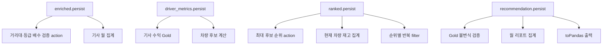

# Silver → Gold 전략적 DataFrame 캐싱

## 1. 문서 목적

Spark DataFrame은 lazy evaluation을 사용한다. 같은 lineage에서 파생된 결과를 여러 action이나
여러 downstream branch가 사용하면, 캐시가 없을 때 upstream scan·join·aggregation이 다시
계산될 수 있다. 반대로 한 번만 사용하는 DataFrame까지 모두 캐싱하면 materialization,
직렬화, executor memory 점유와 해제 비용이 추가된다.

Silver → Gold에서는 "입력이 크다"가 아니라 **비싼 중간 결과가 실제로 두 번 이상
재사용되는가**를 기준으로 `persist()` 위치를 정했다. 전체 Silver 입력을 추가 캐싱하는
대조 실험은 오히려 1.0% 느려져 기각했다.

- 공식 API: [PySpark 3.5.6 `DataFrame.persist`](https://spark.apache.org/docs/3.5.6/api/python/reference/pyspark.sql/api/pyspark.sql.DataFrame.html)
- storage level 확인: [PySpark 3.5.6 `DataFrame.storageLevel`](https://spark.apache.org/docs/3.5.6/api/python/reference/pyspark.sql/api/pyspark.sql.DataFrame.storageLevel.html)
- 적용 코드: [`transformer.py`](../main/spark/jobs/silver_to_gold/transformer.py), [`job.py`](../main/spark/jobs/silver_to_gold/job.py)

## 2. Spark UI에서 읽은 단서

채택 구성의 Spark UI `Executors` 화면에는 다음 값이 표시된다.

- RDD Blocks: `61`
- Storage Memory: `69.5 MiB / 434.4 MiB`
- Disk Used: `0.0 B`
- Completed Tasks: `919`


이 화면은 job 전체의 누적 상태다. RDD block에는 `persist()`로 만든 cache뿐 아니라
`localCheckpoint()`가 caching subsystem에 보관한 block도 포함될 수 있다. 따라서
`61 blocks = 특정 DataFrame의 cache`라고 해석하지 않는다. 이 화면에서 확정할 수 있는 것은
실행 중 중간 block이 memory에 유지됐고, 캡처 시점의 Storage Memory가 전체 한도
434.4 MiB 중 69.5 MiB였으며 disk spill은 0 B였다는 사실이다.

cache별 partition 수, memory size, fraction cached는 Spark UI `Storage` 탭에서 별도로
확인해야 한다. SQL query 상세에서는 두 번째 소비 경로가 `InMemoryTableScan`을 사용하는지도
확인한다. 현재 저장된 캡처에는 Storage 탭 상세가 없으므로 코드의 fan-out과 통제 실험을
함께 근거로 사용한다.

## 3. 캐시 위치를 정한 기준

다음 조건을 모두 만족하는 중간 결과만 캐싱했다.

1. 동일 DataFrame이 서로 다른 downstream branch 또는 action에서 재사용된다.
2. upstream에 scan, join, groupBy, Window처럼 다시 계산하기 비싼 연산이 있다.
3. 캐시 수명주기를 코드에서 명확히 종료할 수 있다.
4. raw 입력보다 필요한 컬럼과 행이 줄어든 중간 결과를 우선한다.



## 4. 전략적 캐시 적용 지점

### 4.1 운행 enrichment 결과

적용 위치: `enrich_trips_with_fuel_cost()`

```python
enriched = (
    trip_rows.join(F.broadcast(profile_rows), ...)
    .join(F.broadcast(price_rows), ...)
    .select(...)
    .persist()
)
```

`enriched`의 upstream에는 월별 운행과 기사 프로필, 일별 연료비 join이 있다. downstream의
`_with_tier_revenue_scenarios()`는 같은 운행에서 거리대·등급별 rate를 집계한 branch와
운행별 시나리오를 계산하는 branch를 다시 결합한다. 결측 배수를 찾는 `collect()` action과
기사 월 집계도 이어진다. 이 중간 결과를 재사용해 dimension join부터 다시 계산되는 범위를
줄인다.

### 4.2 기사 월 집계 내부 결과

적용 위치: `job.py`

```python
driver_metrics = build_driver_monthly_aggregation(
    enriched, year_month, args.service_area
).persist()
```

`driver_metrics`는 운행 단위 데이터를 기사 단위로 groupBy한 결과다. 다음 두 큰 branch의
공통 부모다.

- `build_driver_monthly_profit(driver_metrics)`: 확정 Gold 기사 수익
- `build_monthly_vehicle_recommendation(driver_metrics, inventory)`: 차량 후보 시뮬레이션

이 결과를 캐싱하지 않으면 차량 추천과 기사 수익 검증·출력이 같은 운행 집계를 다시 요구할
수 있다. 원본 운행보다 기사 단위로 축소된 뒤라 raw Silver를 캐싱하는 것보다 cache footprint도
작다.

### 4.3 차량 후보 순위

적용 위치: `_allocate_candidates_by_stock()`

```python
ranked = candidates.withColumn(
    "_driver_rank", F.row_number().over(preference)
).persist()
```

`ranked`에는 기사별 Window 정렬이 포함된다. 이후 다음 경로에서 반복 사용한다.

- 현재 차량이 차지한 모델별 재고 집계
- `max(_driver_rank).first()` action
- 각 후보 순위 반복의 `ranked.filter(...)`

반복문이 끝난 직후 `ranked.unpersist()`를 호출해 차량 후보 전체가 job 종료까지 memory에
남지 않게 한다.

### 4.4 최종 차량 추천

적용 위치: `job.py`

```python
recommendation = build_monthly_vehicle_recommendation(
    driver_metrics, inventory
).persist()
```

추천 결과는 다음 세 경로에서 사용된다.

- 기사 수·재고 초과·음수 수익 불변식 검증
- 월 리포트 집계
- 최종 `toPandas()`와 Gold 적재

추천 계산은 cross join, Window, 순위별 재고 배정 반복을 포함하므로 검증과 출력마다 다시
계산하지 않도록 결과를 유지한다.

## 5. 캐시 해제 수명주기

캐시는 성능을 위한 상태이므로 예외가 발생해도 해제돼야 한다. job은 `finally`에서 세 가지
장수 DataFrame을 해제한다.

```python
finally:
    if enriched is not None:
        enriched.unpersist()
    if driver_metrics is not None:
        driver_metrics.unpersist()
    if recommendation is not None:
        recommendation.unpersist()
```

`ranked`는 함수 내부 반복이 끝나는 즉시 해제한다.

```python
ranked.unpersist()
```

이 구분은 cache의 필요한 수명이 다르기 때문이다.

| DataFrame | 필요한 수명 | 해제 위치 |
| --- | --- | --- |
| `enriched` | Gold 전체 계산 | `job.py`의 `finally` |
| `driver_metrics` | 기사 수익·추천·검증·출력 | `job.py`의 `finally` |
| `recommendation` | 검증·리포트·출력 | `job.py`의 `finally` |
| `ranked` | 재고 배정 반복문 내부 | `_allocate_candidates_by_stock()` 종료 직전 |

## 6. 전체 Silver 입력 추가 캐시 실험

전략적 캐시와 별도로, 검증과 변환 전에 월별 운행 Silver 입력 `hvfhv` 자체를 추가
`persist()`하면 반복 scan이 줄어들 것이라는 가설을 실험했다.

비교 기준은 `spark.sql.shuffle.partitions=32`, AQE 활성화, 기존 broadcast와 기존 전략적
캐시를 유지한 상태다. 추가 입력 캐시만 변경했다.

| 구성 | 실행시간 | 기준 대비 | 결론 |
| --- | ---: | ---: | --- |
| **기존 전략적 캐시만 사용** | **25.194초** | 기준 | 유지 |
| Silver 운행 입력 추가 캐시 | 25.455초 | **0.261초, 1.0% 느림** | 기각 |

Gold 행 수는 두 실행 모두 `2,000 / 2,000 / 1`이었다. 추가 cache는 결과를 바꾸지 않았지만
실행시간을 줄이지도 못했다. raw 입력을 먼저 materialize하고 memory에 올리는 비용이 이
workload에서 절약한 재읽기 비용보다 컸다. 따라서 "Silver는 크니까 캐싱"하지 않고,
join·aggregation 이후 실제 fan-out이 있는 중간 결과만 캐싱한다.

이 실험은 기존 네 개 `persist()` 각각의 제거 전후 성능을 측정한 결과가 아니다. 따라서
현재 전략적 캐시 전체가 정확히 몇 %를 단축했다고 주장하지 않는다. 확인된 수치는 **추가
입력 캐시가 1.0% 느렸다**는 것이고, 기존 캐시의 근거는 반복 사용되는 lineage 구조와 명시적
수명주기다.

## 7. Spark UI 검증 절차

캐시 변경 시 다음 화면과 지표를 확인한다.

### Storage 탭

- 캐시된 RDD/DataFrame 이름
- cached partitions / total partitions
- memory size와 disk size
- fraction cached가 100%인지
- 사용이 끝난 뒤 unpersist로 항목이 제거되는지

### SQL / DataFrame 탭

- 최초 action에서 cache를 채우는 scan
- 후속 action에서 `InMemoryTableScan`이 나타나는지
- 동일한 FileSourceScan과 BroadcastExchange가 반복되는지

### Executors 탭

- Storage Memory 증가량
- peak execution memory와 GC time
- disk spill과 executor lost 여부

### Jobs·Stages 탭

- 캐시 전후 완료 Jobs·Stages 수
- 동일 upstream stage가 여러 action에서 재실행되는지
- cache materialization 자체가 별도 overhead가 되는지

## 8. 재검증 조건

다음 조건이 바뀌면 캐시 위치와 storage level을 다시 측정한다.

- 월별 운행 데이터가 executor memory보다 크게 증가한 경우
- Gold branch가 추가되거나 기존 branch가 제거된 경우
- 차량 모델 증가로 `ranked`와 후보 cross product가 크게 증가한 경우
- executor memory, executor 수 또는 dynamic allocation 정책이 바뀐 경우
- Spark UI에서 GC, disk spill, cache eviction이 증가한 경우

현재 `persist()`는 DataFrame의 기본 storage level을 사용한다. memory pressure가 관측될 때만
`MEMORY_AND_DISK`, `DISK_ONLY` 등 후보를 동일 입력으로 비교한다. storage level knob를 먼저
늘리는 것보다 불필요한 cache를 제거하고 컬럼과 행을 줄인 중간 결과를 캐싱하는 것이 우선이다.

## 9. 결론

이 job의 캐싱 전략은 전체 입력을 무조건 memory에 올리는 방식이 아니다. Spark UI에서
중간 RDD block과 Storage Memory 사용을 확인하고, 코드상 fan-out과 action 경계를 기준으로
네 개 중간 결과만 유지한다. 함수 내부 cache는 즉시, job 범위 cache는 `finally`에서
`unpersist()`한다. 전체 Silver 입력 추가 캐시는 1.0% 느려져 기각했으며, 이 결과를 포함해
"캐시 적용"뿐 아니라 "캐시하지 않을 위치"도 실측으로 결정했다.
