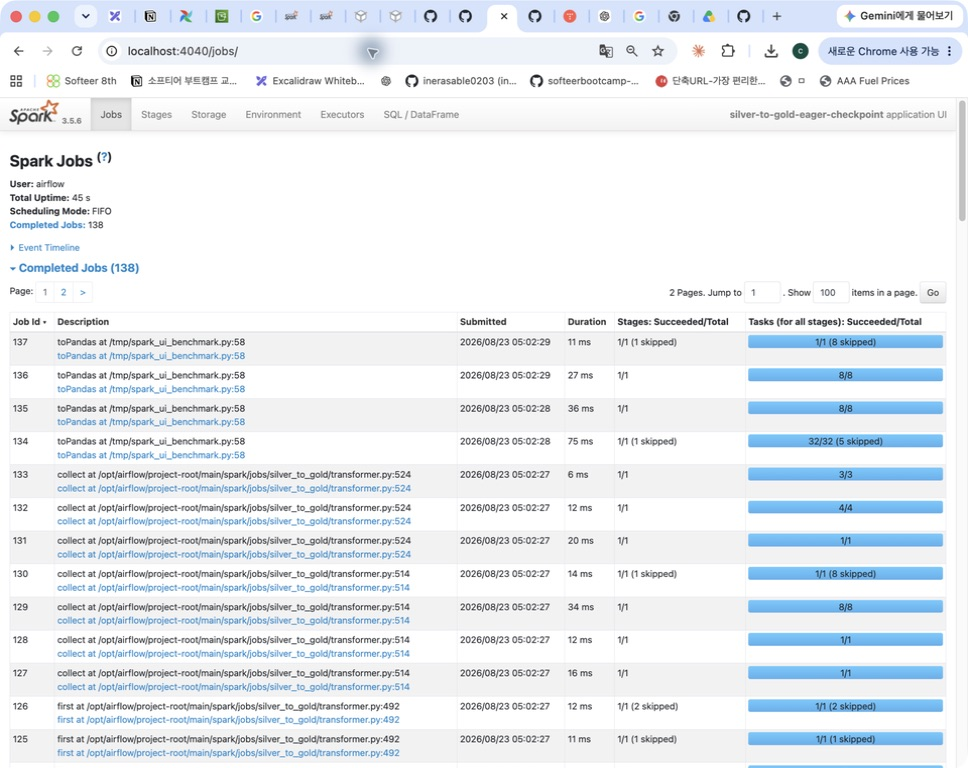
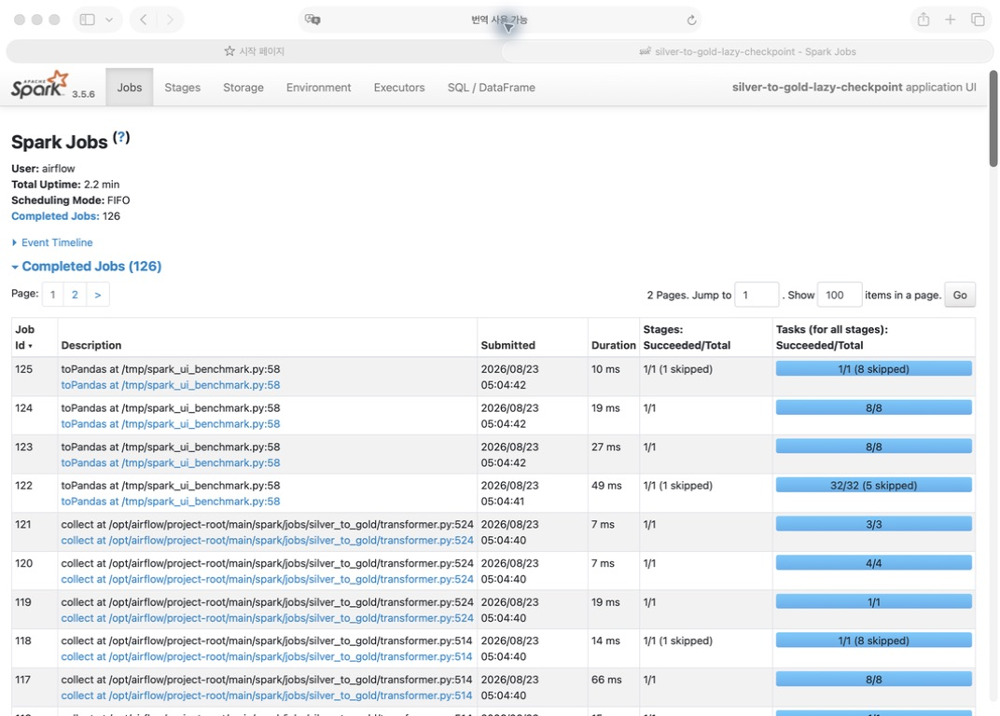
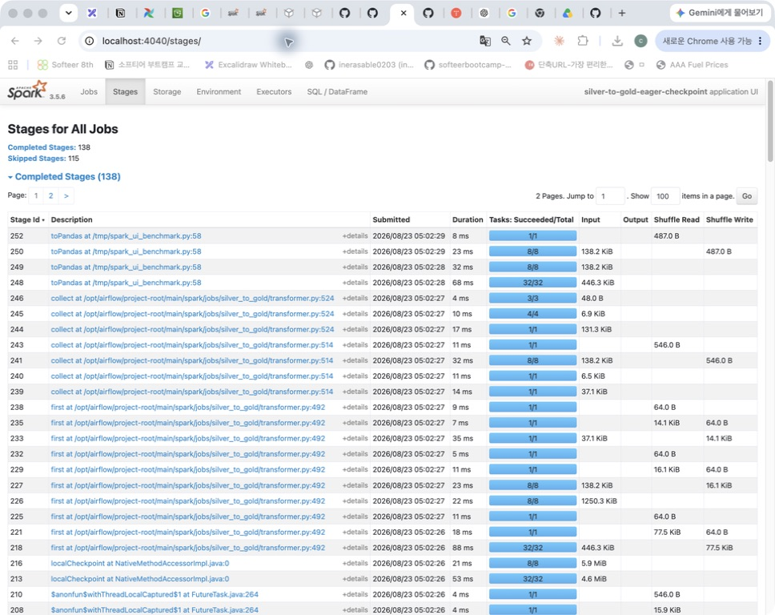

# Shuffle Partition 및 기타 설정 최적화
>목차
>>1. [문제](#문제)
>>2. [문제 해결 접근](#접근)
>>3. [기타 최적화](#기타)

## 문제
- 기존: partition 수 200 고정 (기본값)
- 예상 문제: 계산량 대비 **task scheduling 비용 증가**
- 접근
    1. 목적: 계산량 < task scheduling 비용 확인
        - partition 수만 바꿔 비교 (동일한 입력 및 변환 로직)
        - 측정 범위: Silver - Gold Pandas 계산 지점 (Gold Load 포함 X)

## 접근
### 1. partition 수 절감 이득 확인 (200->16)
> Partition 수가 과하게 많아 Scheduling Overhead가 더 큼

| `spark.sql.shuffle.partitions` | 실행 시간 |
| :--: | :--: |
| 200 (Default) | 41.619초 |
| 16 | 25.302초 |

### 2. partition 수 최적값 찾기
> Partition 수를 8/16/32로 변경하며 최적 개수 찾기

| `spark.sql.shuffle.partitions` | 실행 시간 |
|:--:|:--:|
| 200 | 28.982초 |
| 8 | 28.716초 |
| **32** | **25.194초** |

## 기타
### 추가로 실행한 최적화 실험
> partition 외의 최적화

| 실험 | 소요 시간 | 변경량 | 결론 |
| :---: | :---: | :---: | :---: |
| **AQE 비활성화** | 27.085초 | 7.5% 느림 | **AQE 유지** |
| **broadcast 비활성화** | 28.777초 | 14.2% 느림 | **기존 broadcast 유지** |
| **Silver 입력 추가 캐시** | 25.455초 | 1.0% 느림 | **추가 캐시 기각** |
| **배정 checkpoint 지연**| 21.198초 | 7.3% 단축 | **적용** |

#### Stage 수 감소
- 기존: 재고 배정 반복문에서 **매번 checkpoint 수정**
- 변경: 매번 action을 발생시킬 필요가 없어 **eager=False 설정**해서 비교
- 스테이지 수 비교
    | 방식 | 실행 시간 | 완료 Jobs | 완료 Stages |
    | --- | ---: | ---: | ---: |
    | 기존 eager checkpoint | 22.874초 | 138 | 138 |
    | **lazy checkpoint** | **21.198초** | **126** | **126** |
- 결과 요약: Jobs와 Stages **8.7%** 감소, 실행 시간 **7.3%** 절감
    - 변경 전 JOBS
        
    - 변경 후 JOBS
        
    - 변경 전 Stages
        
    - 변경 후 Stages
        