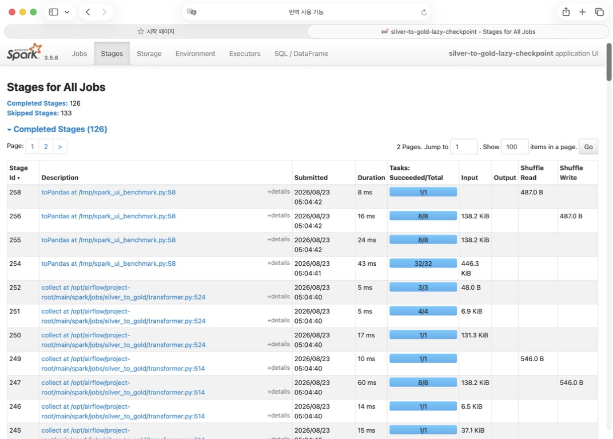

# Silver → Gold Shuffle Partition 최적화

## 1. 문서 목적

이 문서는 `main/spark/jobs/silver_to_gold/` 월별 Gold 집계에서
`spark.sql.shuffle.partitions` 값을 조정한 실험만 기록한다.

Spark 3.5.6에서 `spark.sql.shuffle.partitions`의 기본값은 `200`이며, join이나
aggregation으로 shuffle이 발생할 때 생성할 기본 partition 수를 결정한다.
이 값이 데이터 규모와 실행 자원보다 지나치게 크면 task 한 개가 처리하는 데이터는
작아지는 반면 task 생성, 직렬화, 스케줄링 비용은 계속 발생한다.

- 공식 설정 설명: [Spark 3.5.6 Configuration — `spark.sql.shuffle.partitions`](https://spark.apache.org/docs/3.5.6/configuration.html#spark-sql)
- 적용 대상 DAG: [`monthly_taxi_trip_silver_to_gold_dag.py`](../main/airflow/dags/monthly_taxi_trip_silver_to_gold_dag.py)

## 2. Spark UI에서 확인한 문제

기본값 `200`으로 실행했을 때 Silver → Gold의 여러 shuffle stage가 200개 task로
나뉘었다. 이 job은 월 단위 운행 데이터를 기사 단위로 집계하지만 최종 Gold 결과는
기사 집계 2,000행, 차량 추천 2,000행, 월 리포트 1행이다. 후반부 stage까지 200개 task를
유지하는 것이 실제 계산량에 비해 과도한지 확인할 필요가 있었다.

Spark UI에서 확인할 핵심 항목은 다음과 같다.

1. `Stages` 탭의 `Tasks: Succeeded/Total`
2. task별 처리 시간이 매우 짧은 stage가 다수 생성되는지
3. partition 수를 줄였을 때 전체 실행시간과 결과 행 수가 함께 유지되는지

아래 화면은 최종 채택 구성에서 실행한 Spark UI다. Stage 254의 task가 `32/32`로
완료되어 제출 설정의 shuffle partition 수가 실제 stage에 반영된 것을 확인할 수 있다.
이 이미지는 8·16·32·200 비교표 전체를 증명하는 화면이 아니라, **채택값 32가 실행계획에
적용됐는지 확인하는 운영 증거**로 사용한다.



## 3. 실험 설계

partition 수 외 조건을 동일하게 유지하고 다음 범위를 측정했다.

- 입력: 동일한 Silver 월 파티션 4종
- 변환: 동일한 Silver → Gold 코드
- 시작: Silver DataFrame 읽기
- 종료: Gold 3종을 `toPandas()`로 계산 완료한 시점
- 제외: PostgreSQL 또는 로컬 CSV 적재 시간
- 정합성 확인: Gold 3종 결과 행 수 비교

측정 구간에서 적재를 제외한 이유는 DB 연결과 네트워크 변동을 Spark 계산시간에 섞지
않기 위해서다. 각 후보는 같은 입력과 같은 변환 로직으로 실행하고
`spark.sql.shuffle.partitions`만 변경했다.

## 4. 1차 실측: 기본값이 과한지 확인

| `spark.sql.shuffle.partitions` | 실행시간 | 기본값 대비 변화 |
| ---: | ---: | ---: |
| 200 | 41.619초 | 기준 |
| 16 | 25.302초 | **16.317초, 39.2% 단축** |

첫 실측에서 partition 수를 16으로 줄였을 때 실행시간이 크게 감소했다. 이 결과는
기본값 200에서 task scheduling 비용이 실제 계산시간에 비해 컸다는 가설과 일치한다.
다만 단일 비교로 16을 확정하지 않고 인접 후보를 다시 측정했다.

## 5. 후보 재측정: 8·16·32·200 비교

| `spark.sql.shuffle.partitions` | 실행시간 | Gold 행 수 (`집계 / 추천 / 보고서`) |
| ---: | ---: | ---: |
| 200 | 28.982초 | 2,000 / 2,000 / 1 |
| 8 | 28.716초 | 2,000 / 2,000 / 1 |
| 16 | 28.289초 | 2,000 / 2,000 / 1 |
| **32** | **25.194초** | **2,000 / 2,000 / 1** |

후보 재측정에서는 32개가 가장 빨랐다. 8개와 16개는 scheduling overhead는 더 작지만
동시에 실행할 수 있는 task 수도 줄어 이 workload에서는 32개보다 느렸다. 반대로 200개는
짧은 task를 더 많이 스케줄링하는 비용이 커졌다.

1차 실측과 후보 재측정의 절대 시간이 다른 것은 두 표가 별도 실행에서 수집되었기
때문이다. JVM 준비 상태, OS page cache, 로컬 자원 경쟁을 완전히 고정한 정밀 벤치마크는
아니다. 따라서 서로 다른 표의 절대 시간을 직접 비교하지 않고, 각 실험 안에서 동일 조건의
상대 차이만 판단 근거로 사용했다.

## 6. 채택 결정

다음 두 조건을 함께 만족한 `32`를 채택했다.

1. 측정 후보 중 실행시간이 가장 짧았다.
2. Gold 3종 행 수가 기준 실행과 동일했다.

적용값은 Silver → Gold EMR Spark 제출 파라미터에만 둔다. Bronze → Silver처럼 shuffle
형태와 데이터량이 다른 job에 같은 값을 일괄 적용하지 않는다.

```text
--conf spark.sql.shuffle.partitions=32
```

현재 적용 위치:

```python
EMR_SPARK_SUBMIT_PARAMETERS = (
    "--conf spark.driver.cores=2 --conf spark.driver.memory=6g "
    "--conf spark.executor.cores=2 --conf spark.executor.memory=6g "
    "--conf spark.sql.shuffle.partitions=32 "
    "..."
)
```

## 7. 해석 범위와 재측정 조건

`32`는 보편적인 Spark 최적값이 아니라 현재 월별 데이터량, Gold 로직, 실행 자원에서 얻은
실측값이다. 다음 조건이 바뀌면 같은 후보군으로 다시 측정해야 한다.

- 서비스 지역 추가로 월 입력량이 크게 증가한 경우
- 기사 수 또는 차량 후보 수가 크게 증가한 경우
- executor core·memory 또는 executor 수가 바뀐 경우
- groupBy·Window·join 등 shuffle 연산이 추가되거나 제거된 경우

재측정할 때는 최소 3회 실행의 중앙값, Jobs·Stages·task 수, shuffle read/write,
spill, Gold 행 수와 결과 hash를 함께 남기는 것이 바람직하다. 현재 수치는 최적화 의사결정
당시의 통제 실험 결과이며, 장기적인 성능 기준선은 동일 입력 반복 측정으로 보강할 수 있다.
