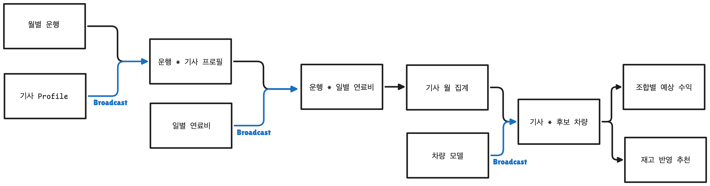

# Broadcast Join 명시 최적화
- 요약
    - AQE/Broadcast 활성화해도 **일부에서 shuffle 발생**
    - **실행 계획 확인**하여 **SortMergeJoin 발견**
    - 참조 데이터에 **Broadcast 명시 적용** -> 실행 시간 **22.9%** 단축
- 목차
    1. [문제](#문제)
    2. [접근](#접근)
    3. [적용 전 후 비교](#적용-전-후-비교)
    4. [한계 검토](#broadcast-한계-검토)

## 문제
- 배경 : Silver to Gold에서 아래 작업 진행
    - 월별 운행 기록 JOIN (기사 차량 스냅샷, 차량 재고, 일별 연료비) + `기사별 현재 수익` / `후보 차량별 예상 수익`계산
        - 아래와 같이 입력 데이터 크기, 역할이 모두 다름
            | 데이터 | 크기 | 역할 |
            | :---: | :--:|:--:|
            |**월별 운행**|대규모(NYC 기준 70-80만, NY확장시 수천만 예상)|**중심 데이터**|
            |기사-차량 프로필|소규모(NYC 기준 2000행, NY 확장시 수만행 예상)|참조 데이터|
            |차량 재고|소규모(NYC 기준 2400행 , NY 확장시 수만행 예상)|참조 데이터|
            |일별 연료비|소규모(월별 28-31행)|참조 데이터|
            |운행 등급 별 수익 증가 배수|10행 (플랫폼 2개 * 거리 구간 5개)|참조 데이터|
- 예상 문제 : 항상 Broadcast를 이용하는게 이득인데, 그러지 않아 불필요한 오버헤드/비용 발생
- 접근 
    1. Spark UI에서 Plan 확인 (Broadcast 명시 X)
    2. Broadcast가 이용되어야 하는 데이터에 Broadcast 명시
    3. 2 결과 Plan 확인
    4. 적용 전과 후 비교 

## 접근
### Broadcast 명시 안했을 때 Plan 확인

| join | Initial Plan | Final Plan | 판독 |
| --- | --- | --- | --- |
| 기사 스냅샷 * 차량 재고 | `BroadcastHashJoin` | `BroadcastHashJoin` | 12행 재고는 자동 판단만으로도 충분 |
| 월별 운행 * 기사 profile | `SortMergeJoin` | `BroadcastHashJoin` | 실행 중 Broadcast로 전환 |
| 운행 * 일별 연료비 | `SortMergeJoin` | `SortMergeJoin` | FINAL PLAN까지 shuffle join 유지 |

- 문제 
    1. 기사 profile에서 `SortMerge Join`
        - initial plan에서 SortMergeJoin이 있기 때문에 shuffle 비용 완전히 사라진 것 X
    2. 연료비는 계속 `SortMergeJoin`사용

### 해결시도: 참조 데이터에 Broadcast 명시
> Broadcast가 항상 적용되어야 하는 부분에 Broadcast 지정

- 참고 다이어그램
    

#### 적용 대상 1. 기사 차량 스냅샷과 차량 재고
- 차량 모델(12행) build side 지정

#### 적용 대상 2. 월별 운행과 기사 profile
- 기사 프로필에 Broadcast 적용
- 기존 : taxi_id 매핑을 위해, 데이터를 파티션별로 재분배하고 정렬(SortMergeJoin)
- 변경후 : 운행 데이터는 그대로, 기사 프로필만 실행 노드들에 복사(BroadcastJoin)

#### 적용 대상 3. 월별 운행과 일별 연료비
- 일별 연료비(28-31행)에 broadcast 명시
    - 날짜 기준 shuffle/sort 제거

#### 적용 대상 4. 수익 배수와 후보 차량 cross join
- 거리별 수익 배수(10행)에 cross join과 join에 broadcast 적용
    - 거리별 수익 배수 : 예상 수익 계산을 위한 거리별 `Standard 대비 Comport 가격 배수`
- 참고) 후보 차량 대수는 자동 Broadcast가 가능하므로, 모델 수가 증가 시 `메모리`, `실행계획` 다시 점검 예정

### Broadcast 명시했을 때 실행 계획

| 입력 | 행 수 | Spark UI operator | Broadcast 내부 크기 |
| --- | ---: | --- | ---: |
| 차량 재고 | 12 | `BroadcastExchange` → `BroadcastHashJoin` | 8.0 MiB |
| 기사 profile | 2,000 | `BroadcastExchange` → `BroadcastHashJoin` | 8.1 MiB |
| 일별 연료비 | 31 | `BroadcastExchange` → `BroadcastHashJoin` | 8.0 MiB |

- SortMergeJoin 사라짐

## 적용 전 후 비교

| 조건 | 1회 | 2회 | 3회 | 중앙값 |
| --- | ---: | ---: | ---: | ---: |
| AQE/자동 Broadcast, Broadcast 명시 X | 11.258초 | 8.722초 | 9.708초 | 9.708초 |
| **AQE/자동 Broadcast, Broadcast 명시 O** | **8.338초** | **6.219초** | **7.484초** | **7.484초** |

## Broadcast 한계 검토
- Broadcast는 Executor에 복사본을 보내기 때문에 메모리 문제가 발생할 수 있어 아래의 경우 재검증할 예정
    - **기사 profile이 executor memory 대비 커진 경우**
    - **차량 모델 수가 크게 늘어 후보와 cross product가 증가**한 경우
    - **BroadcastExchange collect/build 시간이 전체 실행시간에서 유의미**해진 경우
    - **Spark UI에 GC 증가, memory pressure, spill, executor lost**가 나타난 경우
    - **broadcastTimeout이 발생**한 경우
