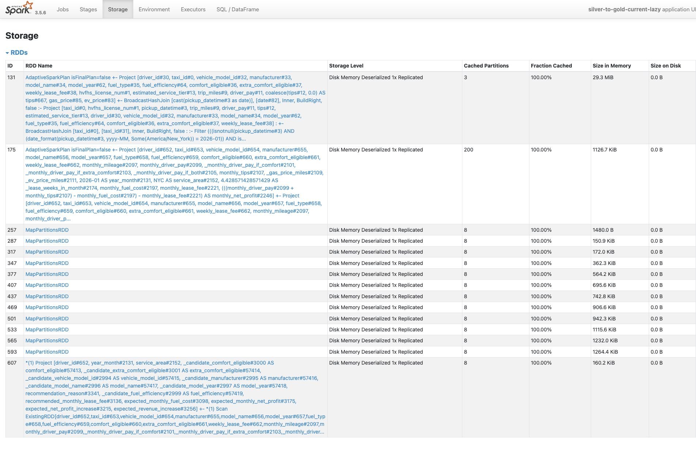
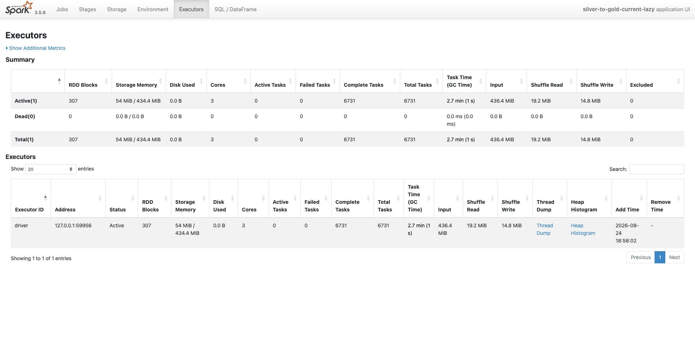

# DataFrame 캐싱 적용
- 요약
    - 같은 계산이 반복되기에 cache를 적용한 개발
    - 그러나 cache는 메모리 문제 발생 
    - 메모리 문제 < 실행 시간 절감인지 확인 
    - 실험 결과
        - 메모리 : 약 36MiB 추가 사용
        - 실행 시간 : **15% 절감** (42.561 -> 36.637)
    - 자주 사용되고, 복잡한 연산이 들어가며, 최대한 가벼운 데이터 위주로 캐싱을 적용하기로 결정
    - 메모리 관련 문제(executor memory pressure / disk spill / eviction)가 발생할 시 다시 검증 예정

- 목차
    1. [개요](#개요)
    2. [접근](#접근)
    3. [적용 전 후 비교](#적용-전-후-비교)
    4. [결론](#결론)

## 개요
> 같은 계산이 여러 곳에서 반복
### 배경 
- Silver to Gold에서 아래 두 결과 생성
    1. 기사별 현재 차량 기준 `월 예상 수익`
    2. 재고를 반영한 `기사별 추천 차량`
- 이때 두 결과는 **운행 정보**와 **기사 월 집계**를 **공유**
    - 또한, **추천 차량 내**에서도 반복문으로 **반복 계산**함.
- 따라서, 처음부터 **캐시를 사용하는 방식으로 개발**했음
### 문제
1. (캐시가 없으면) Spark Lazy Evaluation
    - Cache가 없으면 Action마다 lineage 매번 계산
2. (캐시가 있으면) 메모리 문제
    - 무조건 캐싱하면, Materialization과 Executor Memory 점유율만 증가

### 접근
- Caching으로 인한 **`메모리 비용보다 실행시간 절감이 큰가`**?
    - 재사용 횟수가 많고 계산이 복잡한 중간 결과만 캐싱할 때

- 적용 코드: [transformer.py](../../main/spark/jobs/silver_to_gold/transformer.py), 
  [job.py](../../main/spark/jobs/silver_to_gold/job.py)

### 참고자료
- Spark API: [PySpark 3.5.6 `DataFrame.persist`](https://spark.apache.org/docs/3.5.6/api/python/reference/pyspark.sql/api/pyspark.sql.DataFrame.persist.html)

 
 

## 접근

### persist 없을 때 측정
- 설정 : persist()/unpersist() 동작하지 않도록 변경
    - Checkpoint는 그대로 유지 (캐시만 확인)
- 결과  
    - 여러 검증 action과 출력 action에서 lineage가 재실행
    - **Job** : 최대 **341개** / **실행 시간** : 약 **42초**

## 해결시도
> 특정 조건을 만족하는 DataFrame만 persist
- 조건 
    1. 서로 다른 branch 또는 action에서 두 번 이상 사용
    2. upstream에 join, groupBy, Window처럼 비싼 연산이 존재
    3. cache 수명과 해제 위치가 명확
    4. 가능하면 원본보다 중간 결과에 적용 (메모리 절약)

- 대상
    | DataFrame | upstream 연산 | 재사용 위치 | 해제 시점 |
    | --- | --- | --- | --- |
    | `부가정보 포함된 개별 운행 기록` | 운행 기록, 기사 profile, 연료비 join | 수익 배수 검증, 기사 월 집계 | job 종료까지 |
    | `기사별 한 달 실적` | 운행 단위 → 기사 단위 groupBy | 현재 수익, 차량 추천 | job 종료까지 |
    | `기사별 차량 후보 순위표` | 기사별 후보 Window 정렬 | 최대 순위, 현재 재고, 순위별 filter | 배정 함수 내부 |
    | `최종 기사별 차량 추천 배정표` | 후보 계산, Window, 재고 배정 | 검증, 출력 수집 | job 종료까지 |

### 적용 대상 1. 부가정보 포함된 개별 운행 기록
- 월별 운행에 계산을 위한 부가 정보(기사-차량 테이블, 연료비)를 붙이는 Join 결과
- Join 이후를 캐싱
    - Action과 기사 월 집계가 같은 결과를 읽음

### 적용 대상 2. 기사 월 집계
- 운행 데이터를 기사 2000행으로 GroupBy
    - Gold 2개에 모두 이용됨
    - 양이 작아 캐시 효율이 높음
### 적용 대상 3. 기사별 차량 후보 순위표
- 기사별 후보 차량 정렬
    - 함수 내부에서만 필요하므로 **차량 배정 끝나면 캐시 해제**
- 재고 집계, 순위별 반복에서 같은 결과 이용

### 적용 대상 4. 최종 기사별 차량 추천 배정표
- 기사와 차량 후보별 계산, 재고 배정을 모두 거친 결과
- 검증과 Gold 결과 작성에서 재이용
    - 검증 : 기사 누락, 재고 초과, 중복 key 검사 등
    
### cache 수명주기
- 기사별 차량 후보 순위표는 함수 return 앞에서 해제
    - 예외에서는 해제가 되지 않기에 이후 예외가 추가된다면 try-finally 전환 예정
- 그 외의 job 범위 cache 3개는 finally에서 전체 해제
    
## 적용 전 후 비교

### 비교
| 항목 | JOB 개수 | 시간 절감 | 메모리 사용량 |
| --- | --- | ---|--- | 
| cache off |341개|평균 42.561초 | 1.30 MiB |
| cache on |146개| 평균 36.637초  | 38.55 MiB | 

- cache off에서 메모리 사용은 Checkpoint에서 발생하는 것 1개

### 출력 정확성 
> SHA256 해시값 비교로 둘이 동일한지 확인
- 아래의 값으로 동일했다.
    - driver_aggregation: **6c20f62e316056f285e987cce778ca6f230625ce2e3565affffb251ffcfc0ae6**
    - driver_car_suggestion: **3e2371b42d30ab2e633fa9e79dbbf3016d4b38ca70417a0f5e7bf7e9ed402088**

### 실제로 읽혔는지 확인
- SQL 상세에서 Query가 InMemoryTableScan을 통해 읽는 것 확인

## 결론
- 원본 전체를 캐싱 X -> 메모리 문제 발생
- 가볍고, 재사용이 많으며, 계산 많은 지점 위주로 캐싱 (4개의 데이터 프레임)
- 캐시 해제 명시
- 이후, executor memory pressure / disk spill / eviction이 발생할 시 다시 검증할 예정