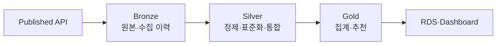

# 재처리 범위를 분리한 메달리온 아키텍처

## 1. 문서 목적

메인 데이터 제품은 Published 원천을 Bronze, Silver, Gold 순서로 처리한다. 이 문서는
수집·정제·비즈니스 계산을 한 단계에 넣지 않고 계층별로 분리한 이유와 재처리 경계를
정리한다.

- 데이터셋 정본: [`DATA_MODEL.md`](../DATA_MODEL.md)
- 데이터 품질·공개 계약: [`DATA_QUALITY.md`](../DATA_QUALITY.md)
- 메인 제품 경계: [`main/README.md`](../../main/README.md)

## 2. 계층 분리가 필요했던 단서

원천 수집과 정제, 추천 계산을 한 job에서 처리하면 다음 문제가 생긴다.

1. 정제 로직만 바뀌어도 외부 API를 다시 호출해야 한다.
2. 장애가 원천·정제·비즈니스 로직 중 어디에서 발생했는지 구분하기 어렵다.
3. 중간 결과가 없어 특정 단계부터 재처리할 수 없다.
4. 소비 목적마다 같은 원천 해석과 정제 규칙을 반복한다.
5. Gold가 외부 API 컬럼과 수집 방식에 직접 의존한다.

## 3. 적용 판단

메인 제품의 계층을 다음 책임으로 고정했다.

| 계층 | 책임 | 하지 않는 일 |
|---|---|---|
| Published | 원천 제품이 외부에 공개한 계약 | main 내부 변환 규칙 소유 |
| Bronze | 받은 원본과 수집 이력 보존 | 정제·집계·업무 판단 |
| Silver | 타입·스키마 표준화와 분석 데이터 생성 | 대시보드용 최종 계산 |
| Gold | 추천·수익 계산 등 서비스 목적 결과 | 원천 형식 해석 |

원천 데이터 제품인 `sub` 내부의 Raw·Curated·Synthesize·Attribution은 main이 직접 읽지
않는다. 두 제품의 경계는 Published API다.

## 4. 계층별 적용 지점

### 4.1 Bronze

API 응답과 EIA 원본을 내용 변경 없이 저장하고 `year_month`와 `collected_at`을 함께
보존한다. Silver 로직만 바뀌면 외부 API를 다시 호출하지 않고 Bronze부터 재처리한다.

### 4.2 Silver

필수 컬럼·타입, 날짜·금액·식별자를 표준화하고 비정상 행을 처리한다. 연료비 통합도
Bronze 원본끼리 직접 결합하지 않고 휘발유와 전력 CLEAN Silver를 만든 뒤 수행한다.

### 4.3 Gold

검증된 Silver만 읽어 기사 월 집계와 차량 추천을 계산한다. Gold는 원천 API URL,
응답 형식과 Bronze 수집 방식을 알지 않는다.

## 5. 재처리 시나리오

| 변경·장애 위치 | 재시작 계층 |
|---|---|
| 원천 수집 실패·원본 변경 | Published → Bronze |
| 정제 규칙·Silver 스키마 변경 | 기존 Bronze → Silver |
| 추천·수익 계산 변경 | 기존 Silver → Gold |
| 대시보드 표현 변경 | 기존 Gold 조회부터 |

이 구분으로 Gold 실패가 원천 재수집으로 이어지거나, Silver 수정이 외부 API 다운로드를
반복하는 일을 막는다.

## 6. 계층 경계의 실패 조건

- Bronze에서 값을 정제하면 원본 재현성이 사라진다.
- Gold가 Bronze를 직접 읽으면 정제 계약이 우회된다.
- 같은 의미의 정제 결과를 여러 Silver 데이터셋이 중복 소유하면 규칙이 어긋난다.
- 통합 결과에 실행 시각만 버전으로 쓰면 입력 계보를 잃는다.
- 검증 전 파일을 공개하면 계층 분리와 무관하게 잘못된 데이터가 전파된다.

## 7. 재검증 절차

1. 각 데이터셋의 입력 계층과 출력 계층을 확인한다.
2. Bronze writer가 원본 내용을 변경하지 않는지 확인한다.
3. Gold job이 Silver 외의 원천을 직접 읽지 않는지 검색한다.
4. Silver 재처리가 외부 API 호출 없이 가능한지 실행한다.
5. 각 계층의 실패가 이전 정상 계층을 삭제하지 않는지 확인한다.
6. `DATA_MODEL.md`의 물리 경로와 실제 writer·reader가 일치하는지 확인한다.

## 8. 결론

메달리온 구조는 폴더 이름을 Bronze·Silver·Gold로 바꾼 것이 아니다. 원본 보존, 정제
계약과 서비스 계산의 실패·재처리 범위를 분리한 설계다. 이 경계를 통해 필요한 계층만
다시 실행하고, Gold가 원천 형식 변화에 직접 흔들리지 않게 했다.
