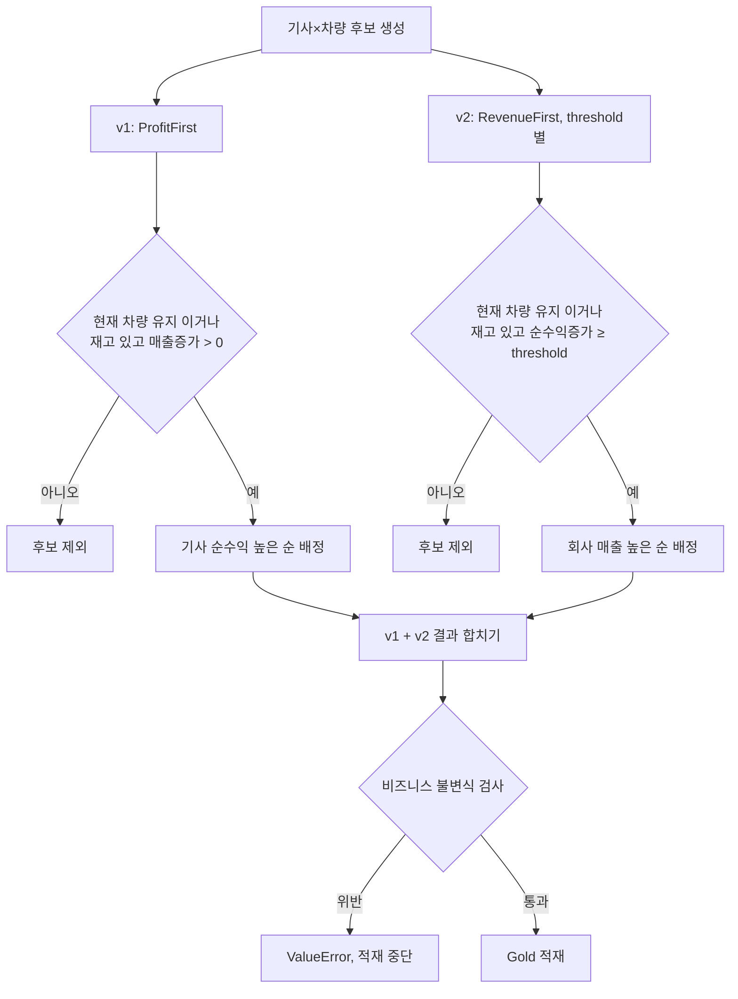

# Gold 추천 로직 (v1/v2)

`driver_car_suggestion`은 기사×차량 후보를 두 알고리즘으로 각각 필터·배정한 뒤 합친 결과다. `threshold`는 기사 순수익 증가액의 하한(USD)이다.

- v1(`ProfitFirstAlgorithm`)은 기사 순수익 기준으로 배정하고, 회사 매출에 기여 못 하는 교체(매출증가 ≤ 0)만 거른다.
- v2(`RevenueFirstAlgorithm`)는 threshold(100~500)별로 회사 매출 기준으로 배정하고, 순수익증가가 threshold 미만인 교체를 거른다.
- 두 알고리즘 모두 "현재 차량 유지"는 필터를 통과한다 — 재고 경쟁 없이 항상 최후의 보루로 남는다.
- 비즈니스 불변식 검사(재고 초과 배정, 순수익 감소 배정 등)는 [DATA_QUALITY_AND_LINEAGE.md](./DATA_QUALITY_AND_LINEAGE.md) 참고.

## 참고

- [`main/spark/jobs/silver_to_gold/recommendation_algorithm/profit_first.py`](../../main/spark/jobs/silver_to_gold/recommendation_algorithm/profit_first.py): v1 필터·배정
- [`main/spark/jobs/silver_to_gold/recommendation_algorithm/revenue_first.py`](../../main/spark/jobs/silver_to_gold/recommendation_algorithm/revenue_first.py): v2 필터·배정
- [`main/spark/jobs/silver_to_gold/transformer.py`](../../main/spark/jobs/silver_to_gold/transformer.py): `validate_gold_business_invariants`
