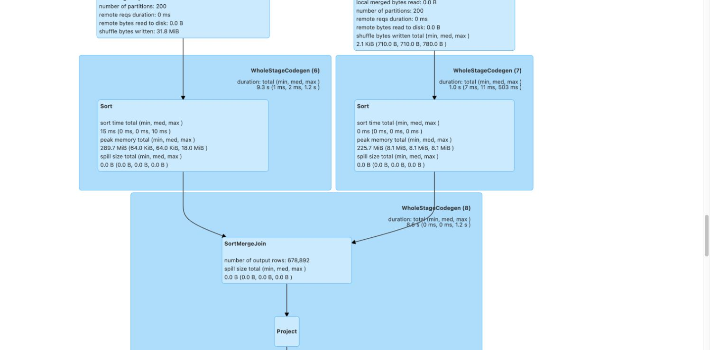
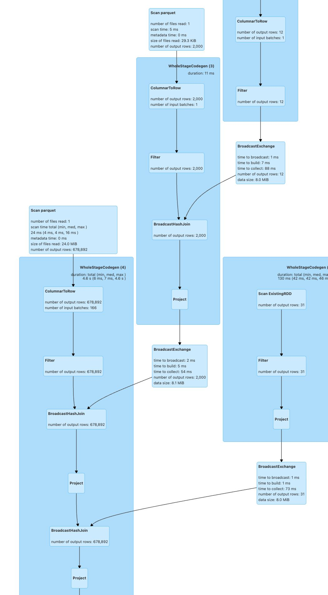

# 작은 참조 데이터를 Broadcast Join으로 처리하기

- 요약
  - 67만 건이 넘는 운행 기록에 수십~수천 행의 참조 데이터를 붙이는 과정에서 큰 데이터까지 재분배하고 정렬하는 실행 계획이 나타남
  - 작은 쪽을 각 실행 노드에 복사하는 `Broadcast Join`을 명시하고, 기사×차량 후보와 임계값 확장에도 같은 방식을 적용
  - 자동 Broadcast와 AQE를 끈 현재 코드 검증에서도 `BroadcastHashJoin` 3개와 `BroadcastExchange` 3개가 나타나고 `SortMergeJoin`은 없었음
  - 전체 파이프라인 반복 측정에서 명시적 Broadcast는 Shuffle Join 강제 조건보다 중앙값 기준 17.0% 빨랐음
  - Python UDF를 사용하지 않아 계산식이 Spark SQL 실행 계획 안에 남음

## 문제

월별 운행 기록은 크지만 차량 정보, 기사별 현재 차량, 일별 연료비는 상대적으로 작다. 크기 차이를 이용하지 않으면 Spark는 양쪽 데이터를 같은 키로 다시 나누고 정렬한 뒤 결합할 수 있다.

실제 Spark UI 캡처에서 678,892행의 운행 흐름과 작은 참조 데이터의 Join 일부가 `SortMergeJoin`으로 실행됐다. 해당 구간 앞에는 200개 파티션의 `Exchange`와 정렬 단계가 있었다. 큰 데이터 쪽에서 기록된 Shuffle Write는 31.8MiB였다.

차량 추천 후보를 만들 때는 기사 N명과 차량 모델 M개의 모든 조합이 필요하다. 결과가 N×M행이 되는 것은 업무 규칙상 피할 수 없다. 다만 M행의 차량 목록까지 클러스터 전체에서 다시 나누는 작업은 피할 수 있다.

## 접근

Join마다 어느 쪽이 월별 운행 기록이고 어느 쪽이 작은 참조 데이터인지 구분했다. 기사 차량 정보, 차량 재고, 일별 연료비, 거리대별 요금 배수는 작은 쪽으로 판단했다.

Spark의 자동 판단에만 맡기지 않고 작은 DataFrame에 `broadcast`를 명시했다. Spark가 작은 데이터를 각 실행 노드에 복사하면 큰 데이터는 현재 파티션에 머문 채 해시 테이블을 조회할 수 있다.

기사×차량 후보와 후보×임계값은 업무상 필요한 `crossJoin`이다. 이 경우에도 작은 차량 목록과 임계값 목록만 Broadcast한다. 후보 행 수 자체를 줄였다고 주장하지 않고, 작은 쪽을 재분배하는 단계만 없애는 데 목적을 뒀다.

현재 코드의 명시적 힌트가 실제 Join 전략을 만드는지는 자동 Broadcast와 AQE를 모두 끈 최소 실행으로 확인했다. 수행 시간은 전체 Silver → Gold 경로에서 자동 Broadcast만 막고 명시적 힌트만 켜고 끄는 방식으로 비교해 다른 최적화 조건을 동일하게 유지했다.

## 해결

운행 기록에 다음 정보를 붙일 때 작은 쪽을 명시적으로 Broadcast했다.

- 기사별 현재 차량 정보
- 차량 모델별 연비와 임대료
- 한 달의 일별 연료비
- 거리대별 프리미엄 요금 배수
- 모델별 재고 한도

추천 후보 생성은 기사별 한 달 운행 실적과 차량 재고 목록의 `crossJoin`으로 구현했다. 차량 목록이 비어 있으면 Join 전에 바로 실패한다. 여러 순수익 임계값을 비교할 때도 5행인 기본 임계값 목록을 Broadcast한다.

계산은 `when`, `concat_ws`, `groupBy`, `Window` 같은 Spark 내장 표현식으로 작성했다. Python UDF와 Pandas UDF는 사용하지 않았다. 연료비, 예상 순수익, 추천 사유가 Spark SQL 계획 안에서 계산되므로 Python 프로세스로 행을 넘기는 직렬화 단계가 생기지 않는다.

원본 정제 단계에서도 필요한 컬럼만 `select`한 뒤 자료형을 변환한다. Parquet가 실제로 읽을 컬럼을 Spark가 계획할 수 있도록 입력 DataFrame 전체를 그대로 전달하지 않았다.

## 검증

아래 적용 전 캡처에는 678,892행을 출력하는 `SortMergeJoin`이 보인다. Join 앞의 두 입력에는 `Exchange`와 `Sort`가 있다.



Broadcast를 명시한 실행 계획에서는 같은 큰 흐름의 Join이 `BroadcastHashJoin`으로 표시된다. 작은 입력에는 `BroadcastExchange`가 있고, 큰 입력 앞에는 Join을 위한 정렬 단계가 없다.



캡처에서 확인되는 입력 규모는 다음과 같다.

| 입력 | 행 수 | 캡처에 표시된 파일 크기 |
|---|---:|---:|
| 월별 운행 기록 | 678,892 | 24.0MiB |
| 기사 차량 정보 | 2,000 | 29.3KiB |
| 일별 연료비 | 31 | 화면상 파일 크기 미표시 |

코드 검색으로 추천과 집계 경로에 Python UDF, Pandas UDF, `F.udf` 사용처가 없음을 확인했다. 대용량 데이터 행을 오류 메시지로 가져올 때는 `collect()` 앞에 `limit(5)`를 둔다. 알고리즘·임계값 조합은 작은 설정 목록이라 고유 조합만 별도로 가져온다. 단일 집계 결과는 `first()`로 읽는다.

현재 구현에서 힌트 자체가 만드는 실행 계획을 확인하기 위해 `spark.sql.autoBroadcastJoinThreshold=-1`, `spark.sql.adaptive.enabled=false`로 설정하고 핵심 운행 결합 결과를 `count()`로 materialize했다.

```text
rows=1
broadcast_hash_joins=3
broadcast_exchanges=3
sort_merge_joins=0
```

따라서 이 최소 실행에서 관측한 Broadcast는 자동 크기 판단이나 AQE 전환이 아니라 코드에 명시한 힌트로 생성됐다.

### 현재 전체 파이프라인 수행 시간

2026-08-27에 현재 코드의 전체 Silver → Gold 계산을 한 번 워밍업한 뒤 각 조건을 3회 측정했다. 조건마다 입력과 캐시, AQE, Shuffle 파티션 수를 같게 두고 `spark.sql.autoBroadcastJoinThreshold=-1`로 자동 Broadcast를 막았다.

- 입력: 운행 678,892행, 기사 2,000명, 차량 12종, 연료비 31일
- 환경: Spark 3.5.6, Java 17, `local[3]`, driver memory 6GiB, Darwin arm64
- 범위: 로컬 Parquet 읽기 → 결합 → 기사 집계 → control total 대조 → v1/v2 추천과 5개 임계값 → 비즈니스 검증 → 두 결과의 `toPandas()`
- 제외: 입력 생성, Spark 시작·워밍업, CSV·PostgreSQL 적재
- 정확성: 매 실행에서 집계 2,000행, 추천 12,000행으로 동일

| 조건 | 1회 | 2회 | 3회 | 평균 | 중앙값 |
|---|---:|---:|---:|---:|---:|
| 명시적 Broadcast | 32.194초 | 28.744초 | 20.292초 | 27.077초 | **28.744초** |
| 힌트 제거, Shuffle Join 강제 | 38.869초 | 34.631초 | 27.687초 | 33.729초 | **34.631초** |

명시적 Broadcast는 중앙값 기준 5.887초, **17.0%** 단축됐고 평균 기준으로는 19.7% 단축됐다. 이는 Broadcast 효과를 분리한 로컬 합성 벤치마크이므로, 자동 Broadcast와 AQE까지 사용하는 EMR의 실제 절감률은 운영 입력과 Spark UI로 다시 측정해야 한다.

## 결론

큰 운행 기록과 작은 참조 데이터의 역할을 코드에 명시했다. Spark UI와 현재 실행 계획에서 작은 쪽은 `BroadcastExchange`, Join은 `BroadcastHashJoin`으로 실행된 것을 확인했다. 현재 로컬 전체 경로에서는 Shuffle Join 강제 조건보다 중앙값 기준 17.0% 빨랐다.

차량 모델이나 기사 프로필이 실행 노드 메모리에 부담을 줄 정도로 커지면 Broadcast 적용 여부를 다시 확인해야 한다. 이때는 데이터 크기, Broadcast 생성 시간, Executor 메모리를 함께 비교한다.

### 관련 코드와 자료

- 참조 데이터 Join: `main/spark/jobs/silver_to_gold/transformer.py`
- 기사×차량 후보 생성: `main/spark/jobs/silver_to_gold/recommendation_algorithm/base.py`
- 임계값 Broadcast: `main/spark/jobs/silver_to_gold/recommendation_algorithm/revenue_first.py`
- Spark UI 캡처: `docs/assets/silver_to_gold_broadcast_auto_aqe_plan.png`
- Spark UI 캡처: `docs/assets/silver_to_gold_broadcast_explicit_plan.png`
