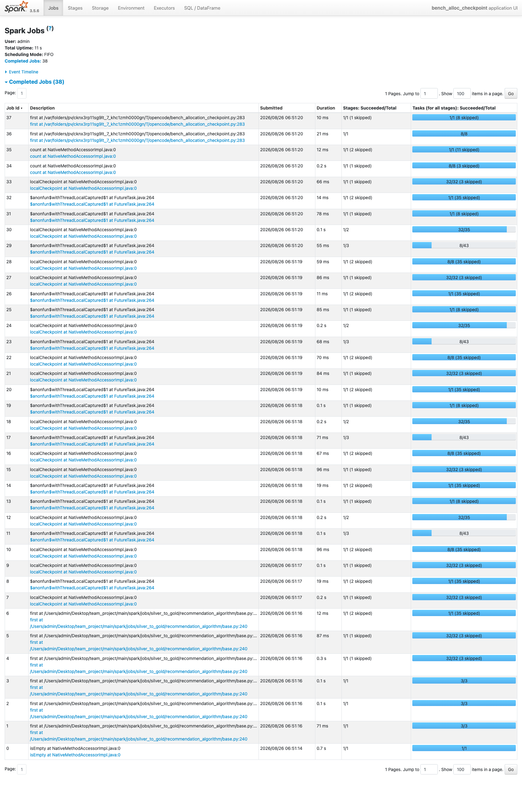
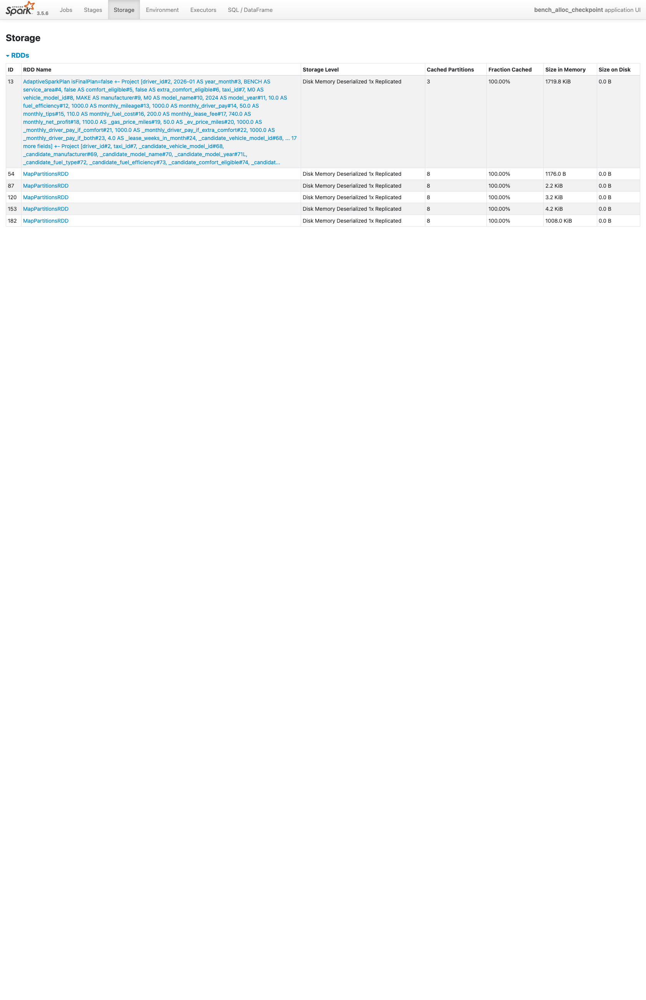

# 반복 배정 루프의 실행 시간과 메모리 부족 문제 해결

- 요약
  - 기사마다 재고가 남은 차량을 배정하는 반복 계산은 라운드가 늘수록 Spark의 계산 계획이 약 4배씩 커졌음
  - 매 라운드가 끝날 때 `localCheckpoint`로 이전 계산과 연결을 끊고, 반복해서 읽는 후보 순위만 메모리에 저장
  - 기사 2,000명 × 차량 모델 3종에서 실행 시간이 7.40초에서 3.28초로 약 56% 감소
  - 모델 5종에서는 기존 방식이 884.65초 후 메모리 부족으로 실패했지만, 변경 후에는 4.68초에 기사 2,000명의 배정을 완료
  - 전체 Silver → Gold의 Shuffle 파티션은 현재 40개이며, 로컬 반복 측정에서는 8개가 가장 빨랐으므로 운영 EMR에서 8·16·32·40을 다시 비교해야 함

## 문제

이 파이프라인은 기사별 예상 수익을 계산한 뒤 재고가 남은 차량을 한 대씩 배정한다. 먼저 기사마다 후보 차량의 순위를 정한다. 1순위 차량의 재고가 부족하면 배정받지 못한 기사는 다음 라운드에서 2순위 차량을 검토한다.

Spark는 DataFrame 연산을 바로 실행하지 않는다. 결과가 필요할 때까지 어떤 계산을 수행할지만 기록한다. 이를 지연 실행이라고 한다.

배정 루프에서는 새 라운드가 이전 라운드의 결과를 두 번 참조한다.

- 아직 차량을 배정받지 못한 기사 확인
- 차량 모델별로 이미 사용한 재고 집계

이전 결과를 참조할 때 그 결과를 만든 전체 계산 절차도 함께 이어진다. 라운드가 반복되면 같은 계산 절차가 계획 안에 여러 번 들어간다. 데이터 행 수가 크지 않아도 계획을 분석하는 드라이버의 시간과 메모리 사용량이 먼저 늘어날 수 있었다.

실제 비교에서 기사 2,000명과 차량 모델 5종을 처리한 기존 방식은 884.65초 동안 실행된 뒤 Java Heap 메모리 부족으로 종료됐다. 결과 데이터는 만들어지지 않았다.

## 접근

먼저 데이터 크기와 계산 계획 크기를 분리해서 확인했다. 기사 300명과 차량 모델 9종으로 후보 데이터를 만들고, 결과를 실행하지 않은 상태에서 라운드별 Spark 논리 계획의 문자열 길이를 측정했다.

| 라운드 | 기존 방식 | `localCheckpoint` 적용 |
|---:|---:|---:|
| 1 | 34,899자 | 559자 |
| 2 | 192,616자 | 559자 |
| 3 | 867,476자 | 559자 |
| 4 | 3,742,884자 | 559자 |
| 5 | 15,948,388자 | 559자 |
| 6 | 67,585,892자 | 559자 |

기존 방식의 계획은 라운드마다 약 4.2~5.5배 커졌다. 6번째 라운드에서는 6,700만 자를 넘었다. 반면 이전 계산과 연결을 끊은 계획은 모든 라운드에서 559자로 유지됐다.

이 결과로 느린 원인을 후보 데이터의 행 수보다 반복해서 복제되는 계산 계획에서 찾았다. 모든 중간 결과를 메모리에 저장하는 대신, 용도가 다른 두 문제를 나눠 처리했다.

- 여러 라운드가 다시 읽는 후보 순위는 메모리에 저장한다.
- 라운드가 끝날 때까지 쌓인 계산 계획은 다음 라운드로 넘기지 않는다.

반복 루프 내부의 checkpoint 파티션 수와 전체 Spark SQL Shuffle 파티션 수는 분리해서 판단했다. 전자는 작은 라운드 결과의 RDD 블록 수를 제한하고, 후자는 전체 Silver → Gold의 `groupBy`, Window, Join 같은 Exchange 이후 병렬도를 정한다.

## 해결

기사별 후보 순위는 라운드 시작 전에 한 번 계산하고 `persist`한다. 각 라운드는 저장된 순위를 읽는다. 배정이 끝나면 `unpersist`해 메모리에서 해제한다.

각 라운드의 배정 결과에는 `coalesce(8).localCheckpoint(eager=False)`를 적용했다. 다음 라운드는 처음 후보를 만들었던 Join과 앞선 모든 라운드를 다시 참조하지 않는다. checkpoint로 남긴 직전 결과에서 계산을 시작한다.

`coalesce(8)`은 현재 실행 규모에서 checkpoint 파티션이 과도하게 늘어나는 것을 막기 위해 사용했다. 8개는 모든 데이터 크기에 맞는 값이 아니므로 입력 규모나 클러스터 구성이 바뀌면 다시 측정해야 한다.

## 적용 전후 비교와 검증

동일한 합성 데이터와 Spark 설정에서 `localCheckpoint` 한 줄만 제외한 방식과 현재 방식을 비교했다. 모델당 재고는 2대이며, Spark는 노트북의 `local[3]` 모드로 실행했다.

### 완료 가능한 3라운드 비교

| 항목 | 기존 방식 | 변경 후 |
|---|---:|---:|
| 실행 시간 | 7.40초 | 3.28초 |
| Spark Job 수 | 269개 | 26개 |
| Task 수 | 1,330개 | 664개 |
| Shuffle Read | 3.3MiB | 0.4MiB |
| Shuffle Write | 3.3MiB | 0.2MiB |
| 배정 결과 행 수 | 2,000개 | 2,000개 |
| 결과 체크섬 | -120522737923 | -120522737923 |

실행 시간은 한 번의 로컬 측정에서 7.40초에서 3.28초로 약 56% 줄었다. Job 수는 269개에서 26개로 줄었다. 결과 행 수와 기사·차량 조합의 해시 합이 같으므로 변경 전후에 같은 배정 결과가 만들어졌다는 것도 확인했다.

### 기존 방식이 완료되지 않은 5라운드 비교

| 항목 | 기존 방식 | 변경 후 |
|---|---:|---:|
| 실행 결과 | 메모리 부족으로 실패 | 정상 완료 |
| 종료까지 걸린 시간 | 884.65초 | 4.68초 |
| 배정 결과 행 수 | 생성되지 않음 | 2,000개 |
| Spark Job 수 | 수집 실패 | 38개 |
| Task 수 | 수집 실패 | 1,066개 |
| Memory / Disk Spill | 수집 실패 | 0MiB / 0MiB |

기존 방식은 완료되지 않았으므로 두 시간을 나눠 속도 배수로 표현하지 않았다. 확인한 사실은 기존 방식이 14분 44.65초 후 실패했고, 변경 후 실행은 같은 크기의 입력을 4.68초에 완료했다는 것이다.

실패 실행에서는 JVM이 종료돼 Spark UI 지표를 끝까지 수집하지 못했다. 성공 실행의 UI에서는 후보 순위 캐시와 라운드별 checkpoint 결과가 실제로 저장된 것을 확인했다.





### 전체 파이프라인 Shuffle 파티션 비교

현재 EMR Serverless 제출 설정은 다음과 같다.

```text
spark.dynamicAllocation.minExecutors=1
spark.dynamicAllocation.initialExecutors=5
spark.dynamicAllocation.maxExecutors=5
spark.executor.cores=2
spark.sql.shuffle.partitions=40
```

따라서 현재 적용값은 32개가 아니라 **40개**다. 최대 Executor 코어는 `5 × 2 = 10`개이고 40개 파티션은 최대 자원 기준 4 wave다. 계약 테스트도 Shuffle 파티션 수가 최대 Executor 코어 수의 배수인지 검사한다.

2026-08-27에 현재 코드의 전체 Silver → Gold 계산을 한 번 워밍업한 뒤 Shuffle 파티션 수만 바꾸어 각 조건을 3회 측정했다. 조건 순서는 회차마다 회전시켰다.

- 입력: 운행 678,892행, 기사 2,000명, 차량 12종, 연료비 31일
- 환경: Spark 3.5.6, Java 17, `local[3]`, driver memory 6GiB, Darwin arm64
- 공통 설정: 명시적 Broadcast, 선택적 캐시, AQE 활성화
- 범위: 로컬 Parquet 읽기 → 결합 → 기사 집계 → control total 대조 → v1/v2 추천과 5개 임계값 → 비즈니스 검증 → 두 결과의 `toPandas()`
- 제외: 입력 생성, Spark 시작·워밍업, CSV·PostgreSQL 적재
- 정확성: 모든 실행에서 집계 2,000행, 추천 12,000행으로 동일

| Shuffle 파티션 수 | 1회 | 2회 | 3회 | 평균 | 중앙값 |
|---:|---:|---:|---:|---:|---:|
| **8** | 20.210초 | 21.504초 | 16.976초 | **19.563초** | **20.210초** |
| 16 | 21.975초 | 26.870초 | 17.629초 | 22.158초 | 21.975초 |
| 32 | 25.501초 | 28.424초 | 27.255초 | 27.060초 | 27.255초 |
| 현재 운영값 **40** | 28.131초 | 28.162초 | 32.825초 | 29.706초 | 28.162초 |
| 200 | 53.943초 | 60.993초 | 59.232초 | 58.056초 | 59.232초 |

중앙값 기준 8개는 현재 운영값 40보다 28.2%, Spark 기본값 200보다 65.9% 빨랐다. 로컬 실행 슬롯이 3개뿐인 조건에서는 작은 파티션 수가 유리했고, 200개에서는 반복되는 작은 Task의 scheduling overhead가 크게 나타났다.

이 결과만으로 운영값을 8개로 바꾸지는 않는다. 운영 EMR의 최대 10코어와 로컬 3코어는 병렬도가 다르고 입력 분포, Shuffle 크기, 네트워크 비용도 다르다. 운영값 변경 여부는 같은 8·16·32·40 후보를 운영 입력에서 다시 측정해 결정한다.

## 결론

반복 배정의 병목은 데이터 행 수만의 문제가 아니었다. 이전 라운드의 전체 계산 절차가 다음 라운드에 중복해서 들어가면서 Spark 계획이 빠르게 커지고 있었다.

반복해서 읽는 후보 순위는 메모리에 남기고, 매 라운드 결과는 `localCheckpoint`로 이전 계산과 분리했다. 그 결과 완료 가능한 비교에서는 실행 시간이 7.40초에서 3.28초로 줄었다. 라운드가 5개인 비교에서는 884.65초 후 실패하던 계산이 4.68초에 완료됐다.

전체 파이프라인의 Shuffle 파티션은 현재 40개다. 로컬 측정에서는 8개가 가장 빨랐지만 이는 운영 최적값을 뜻하지 않는다. 따라서 “32개로 최적화”가 현재 상태라는 설명은 맞지 않으며, EMR에서 후보별 수행 시간과 Task 크기·spill·skew를 다시 확인해야 한다.

### 한계

측정값은 Spark 3.5.6을 노트북 한 대에서 실행한 결과다. 운영 클러스터의 실행 시간으로 일반화할 수 없다. 클러스터 배포 후에는 동일 월 데이터를 사용해 실행 시간과 checkpoint 저장 비용을 다시 비교해야 한다.

라운드가 1~2개로 짧으면 checkpoint를 기록하는 비용이 더 크게 보일 수 있다. 차량 모델 수와 후보 수가 달라지면 적용 주기와 파티션 수를 다시 측정해야 한다.

Shuffle 파티션 최적값도 Executor 수·코어, 월별 운행량, AQE의 파티션 병합 결과가 바뀌면 달라진다. 운영에서는 수행 시간뿐 아니라 scheduling time, Shuffle spill, GC, skew와 너무 작은 Task의 비율을 함께 비교해야 한다.

### 관련 코드와 측정 자료

- 배정 루프: `main/spark/jobs/silver_to_gold/recommendation_algorithm/base.py`
- 후보 순위 캐시와 해제: `main/spark/jobs/silver_to_gold/recommendation_algorithm/base.py`
- 여러 임계값이 공유하는 후보 캐시: `main/spark/jobs/silver_to_gold/recommendation_algorithm/revenue_first.py`
- 운영 Shuffle 파티션 설정: `main/airflow/dags/monthly_taxi_trip_silver_to_gold_dag.py`
- Shuffle 파티션 계약 테스트: `main/airflow/tests/test_emr_serverless_runtime.py`
- 계획 크기: `docs/spark_performance_optimization/assets/plan_growth.json`
- 3라운드 지표: `docs/spark_performance_optimization/assets/metrics_no_checkpoint_m3.json`, `docs/spark_performance_optimization/assets/metrics_checkpoint_m3.json`
- 5라운드 지표: `docs/spark_performance_optimization/assets/metrics_no_checkpoint_m5.json`, `docs/spark_performance_optimization/assets/metrics_checkpoint_m5.json`
