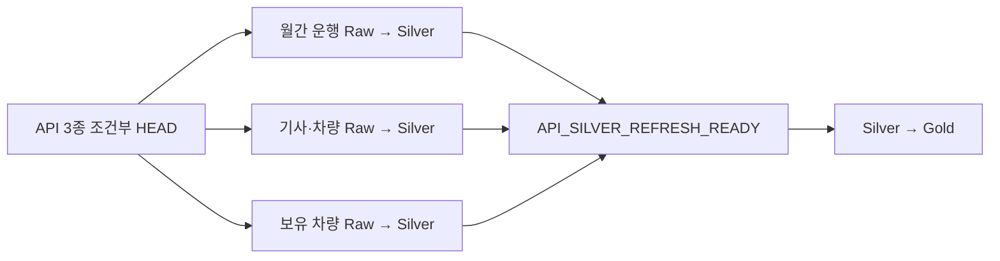

# Gold 중복 실행을 방지하는 Source API 통합 제어

## 1. 문서 목적

회사 API 3종은 매일 변경 여부를 확인하고 변경된 데이터만 Raw → Silver로 처리한다.
이 문서는 여러 API가 같은 날 바뀌었을 때 개별 Silver 완료 이벤트가 Gold를 반복 실행한
원인과 `source_api_refresh_pipeline`으로 완료 신호를 통합한 과정을 정리한다.

- 조정 DAG: [`source_api_refresh_dag.py`](../../../main/airflow/dags/source_api_refresh_dag.py)
- 변경 감지 Task: [`tasks.py`](../../../main/airflow/scripts/source_api_refresh/tasks.py)
- 회귀 테스트: [`test_source_api_refresh_dag.py`](../../../main/airflow/tests/test_source_api_refresh_dag.py)

## 2. 발견한 증상

월간 운행과 보유 차량 원천이 함께 변경되면 두 Raw → Silver DAG의 완료 시각이 달랐다.
먼저 끝난 Silver가 Gold를 실행하고 나중에 끝난 Silver가 같은 지역·월의 Gold를 다시
실행했다.

```text
보유 차량 Silver 완료 ───────→ Gold 실행 1
월간 운행 Silver 완료 ───────→ Gold 실행 2
```

각 Silver는 한 번만 처리됐지만 무거운 Spark Gold 연산과 RDS 적재가 중복됐다.
`max_active_runs=1`은 두 실행을 직렬화할 뿐 이미 예약된 DagRun을 제거하지 못했다.

## 3. 원인

개별 Silver의 부분 완료 신호와 Gold가 읽을 API 입력 묶음의 준비 완료 신호를 같은
Asset으로 취급했다. Airflow Asset의 `OR` 조건은 여러 이벤트를 한 배치로 모으는
barrier가 아니므로 생산자마다 별도의 Gold 실행 원인이 됐다.

또한 본문을 먼저 다운로드해 Bronze에서 비교하면 변경되지 않은 데이터도 매일 전송하고
읽어야 했다. 지역과 데이터 규모가 늘수록 변경 확인 자체의 비용이 커지는 구조였다.

## 4. 적용 판단

`source_api_refresh_pipeline`을 API 3종의 coordinator로 두었다.

1. 본문 대신 조건부 `HEAD`로 `ETag`와 `Last-Modified`를 비교한다.
2. 변경 또는 복구가 필요한 원천만 하위 Raw → Silver DAG를 실행한다.
3. 실행한 하위 DAG가 모두 끝날 때까지 기다린다.
4. 성공한 원천만 처리 상태를 기록한다.
5. 마지막 합류 지점에서 READY Asset을 한 번만 발행한다.

## 5. 적용 구조



하위 DAG는 `TriggerDagRunOperator(wait_for_completion=True)`로 기다리고, READY Task는
`NONE_FAILED_MIN_ONE_SUCCESS`를 사용한다. 모두 미변경이면 발행하지 않고, 대상 중 하나라도
실패하면 불완전한 묶음을 공개하지 않는다.

## 6. 조건 검증

| API 처리 결과 | READY Asset |
|---|---|
| 모두 미변경이고 기존 적재본 정상 | 발행하지 않음 |
| 한 개 이상 변경·복구 필요, 대상 모두 성공 | 한 번 발행 |
| 처리 대상 중 하나라도 실패 | 발행하지 않음 |
| 같은 지역·월의 여러 API 동시 변경 | 한 번 발행 |

READY Task는 변경 결과의 `year_month`를 집합으로 모아 같은 월이 여러 번 들어와도
파티션을 한 번만 추가한다.

## 7. 재검증 절차

1. API 3종을 모두 미변경으로 만들어 READY가 발행되지 않는지 확인한다.
2. 두 원천을 같은 월에 변경해 하위 DAG 두 개가 실행되는지 확인한다.
3. 완료 순서를 바꿔도 READY가 한 번만 발행되는지 확인한다.
4. 한 하위 DAG를 실패시켜 READY와 Gold가 실행되지 않는지 확인한다.
5. 같은 ETag 재실행에서 불필요한 본문 다운로드가 없는지 확인한다.
6. `max_active_runs`가 아니라 Asset 이벤트 수로 중복 여부를 판단한다.

## 8. 결론

문제는 Gold 동시성 값이 아니라 완료 이벤트의 의미였다. 개별 Silver 완료를 coordinator의
입력 묶음 READY로 바꾸고 변경 확인을 본문 다운로드 앞에 배치해 불필요한 수집과 Gold
중복 실행을 함께 줄였다.
